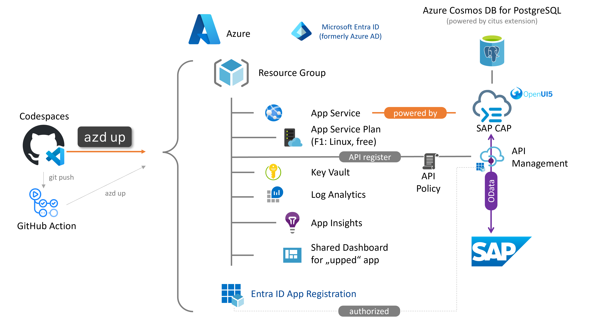

# Quest 1 - Understand what we want to build

In this tutorial, you will build an application built with the [SAP Cloud Application Programming Model (CAP) for Node.js](https://cap.cloud.sap/docs/get-started/jumpstart) to consume OData services from SAP S/4HANA running on Azure App Services backed with [Azure Cosmos DB for PostgreSQL](https://learn.microsoft.com/azure/cosmos-db/postgresql/introduction). 

This tutorial is based on the public quickstart project [Azure-Samples/app-service-javascript-sap-cap-quickstart](https://github.com/Azure-Samples/app-service-javascript-sap-cap-quickstart) which will deploy following application components:

> [!TIP]
> In the interest of time, this tutorial will apply following simplications:
> - GitHub Actions and the Azure Developer CLI allow you to set up CI/CD processes to control your deployments. See [CI/CD Setup via Azure Developer CLI](https://github.com/Azure-Samples/app-service-javascript-sap-cap-quickstart/blob/main/documentation/AZD-CICD-SETUP.md) if you want to learn more about this.
> - API Management will allow for principal propagation to map Entra identities to SAP identities. [Authentication with Microsoft Entra ID](https://github.com/Azure-Samples/app-service-javascript-sap-cap-quickstart/blob/main/documentation/AUTHENTICATION.md) will provide more insights into this.
> So, feel free to keep a bookmark to the sample repository and come back to it at a later point in time. 

## Legend:

We'll have some notes for you as you go:

> [!TIP]
> A tip will provide with some further information and insights. 

> [!IMPORTANT]
> An 'Important' box will will provide some instructions for this tutorial.

## Where to next?

**[🏠Home](../README.md)** - [ Quest 2 >](quest2.md)

[🔝](#)
