# Quest 2 - Prepare your development environment

In this quest, you will prepare your development environment for this tutorial. You will therefore GitHub repository that contains the code for our project. Instead of installing a bunch of tools on your own computer, you will leverage [GitHub Codespaces](https://github.com/features/codespaces) to create a cloud-hosted development environment with all prerequesites already set up.

## Create your fork

- Log in to Github

- Browse to [MartinPankraz/DSAGTechXChange24: Content supporting the DSAG TechXChange Feb 2024](https://github.com/MartinPankraz/DSAGTechXChange24) 

- Fork the repository into your own GitHub account.
  
  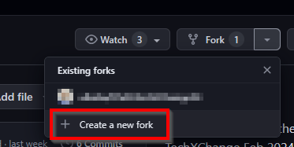

  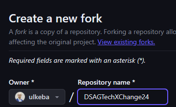

## Prepare your development environment

You have two options:

- Do it "the conventional way" and set up your development environment on your machine. 

  This will require you to install all the tools needed to build and deploy the application -- such as [Node.js — Download](https://nodejs.org/en/download/), [Azure Command-Line Interface (CLI)](https://learn.microsoft.com/en-us/cli/azure/) and the [Azure Developer CLI](https://learn.microsoft.com/en-us/azure/developer/azure-developer-cli/overview). It will also require you to set up and configure your [Git](https://git-scm.com/) and clone the repository.

- Do it "the easy way and use [GitHub Codespaces](https://github.com/features/codespaces).

  GitHub Codespaces allows you to use a preconfigured development environment hosted on GitHub. It will include all required tools and a clone of the repository you will be working with. You can access this development environment either via a browser or using the VS Code installation on your developer machine.

> [!IMPORTANT]
> We will focus on the GitHub Codespace way going forward.

### Initialize your codespace

- Open your fork of the repository.

- Create a new Codespace on main:

  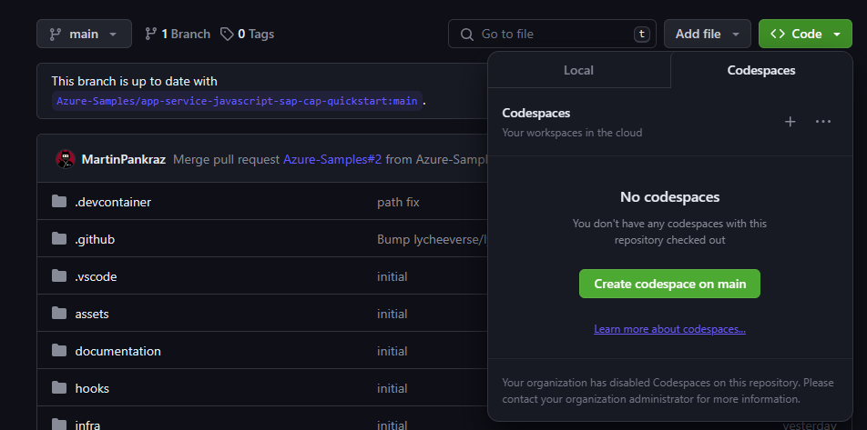

> [!TIP]
> Every GitHub user account comes with a [free plan](https://github.com/features/codespaces) that will allow running codespaces for a limited amount of time.

- Wait a couple of seconds until deployment of your code space has terminated:

  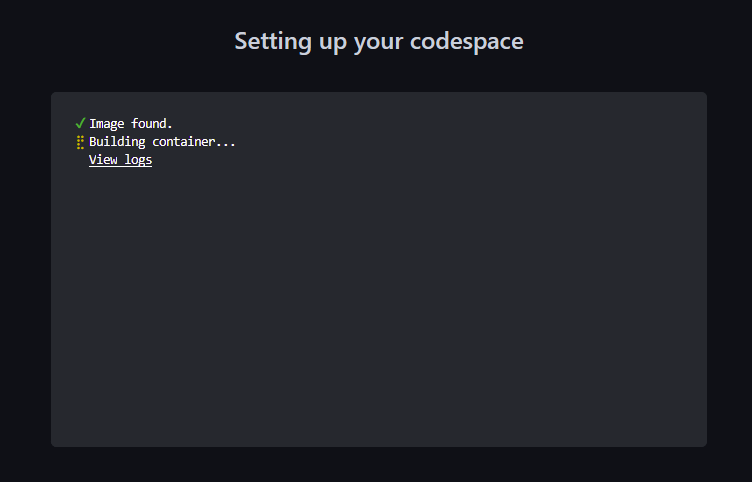

  Following the 'logs', you can see how GitHub prepares the your development environment by installing all prerequesites for your development cycle.


- Once your dev container is available, you'll see VS Code with your repo opened in your browser: 

  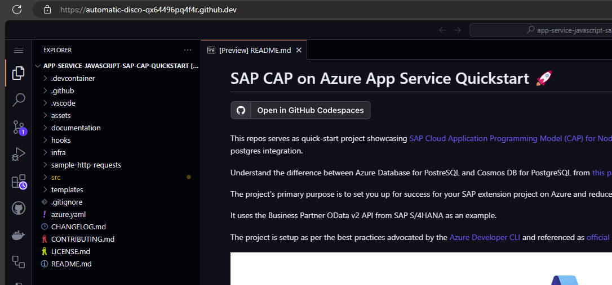

> [!TIP]
> <details><summary>If you are not yet familiar with VS Code...</summary>
>  
> ...you might want to inspect the different panes:
>  - The vertical bar on the left side allows you to swith between a file Explorer, a search area as well as control elements to control your git operations (like staging and commiting changes).
> - On the bottom of the page, you have the option to open a Terminal view; different command line interpreters (bash and PowerShell) are available to invoke commands and use the CLI tools available within your GitHub Codespace.
> 
> </details>


> [!TIP]
> <details><summary>If you are interested to see how GitHub knows which components it has to deploy into your codespace...</summary>
>  
> ...you may want to browse file `.devcontainer/devcontainer.json`. It lists CLI tools such as `azure-cli` (in the `features` section) as well as extensions for VS Code (in the section `customizations / vscode / extensions`).
> 
> </details>

> [!IMPORTANT]
> We will use the bash interpreter in the the remainder of this tutorial.

- To confirm CLI tools are well set up, invoke following commands in terminal at the bottom of the VS Code view:

  ```
  az version
  ```
  
  The output should look like that:
  ```
    @username ➜ /workspaces/app-service-javascript-sap-cap-quickstart (main) $ az version
    {
    "azure-cli": "2.56.0",
    "azure-cli-core": "2.56.0",
    "azure-cli-telemetry": "1.1.0",
    "extensions": {}
    }
  ```

  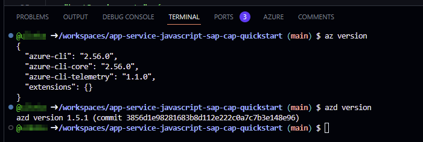

> [!IMPORTANT]
> When showing output of CLI interaction, we will in most cases show the text output and avoid adding the respective screenshots. Please don't worry if coloring and formatting slightly differ.

### (Optional) Use your local VS Code installation to connect to your codespace from your developer machine.

> [!IMPORTANT]
> In the interest of time, we recommend you to stay with the browser-based Codespace UI and skip the following steps. If you want to come back at a later point in time, feel free to follow up here to connect your local VS Code with a GitHub Codespace.

- Start the VS Code deployed on your developer machine.

- Make sure you have the extension "GitHub Codespaces" installed.

  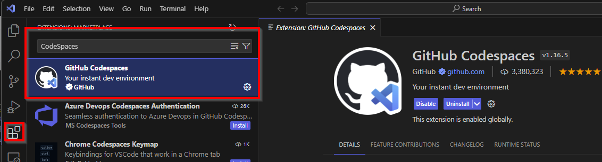

- Once installed, open the command palette by pressing `Ctrl + Alt + p`, type `Codespaces` and select `Connect to codespace`:
  
  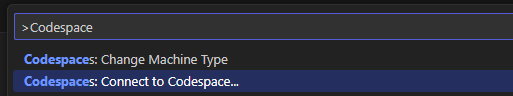

- Login to GitHub from VS Code.

  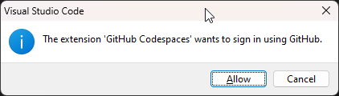

- Select the codespace you have just created.

  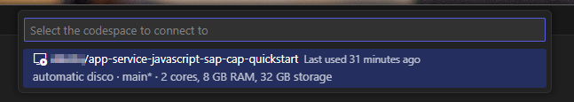

- See how VS Code refreshes and loads your repo content in your local VS Code window.

- :bulb: Open a new Terminal and run `az version` and `azd version`.

  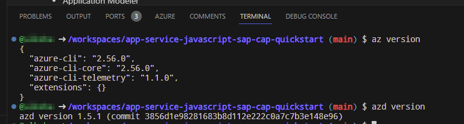

  You might also want to run command `hostname` and `uname -a` to see that these commands effectively run on your Codespace (and not your developer machine):

  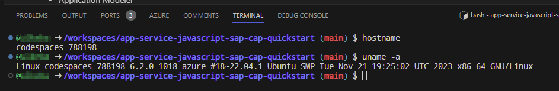

  

## Where to next?

[ < Quest 1 ](quest1.md) - **[🏠Home](../README.md)** - [ Quest 3 >](quest3.md)

[🔝](#)
