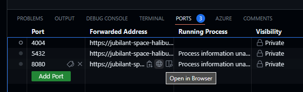
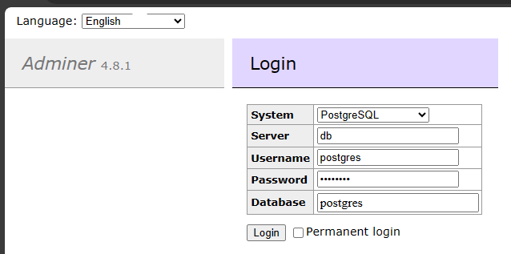
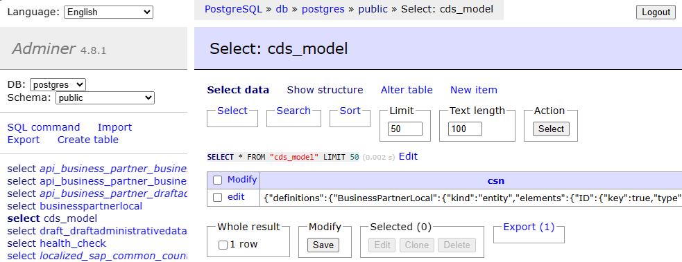
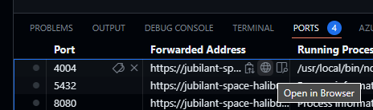
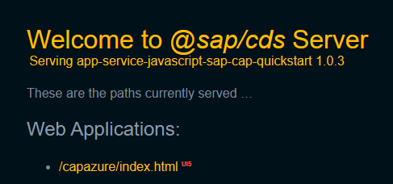
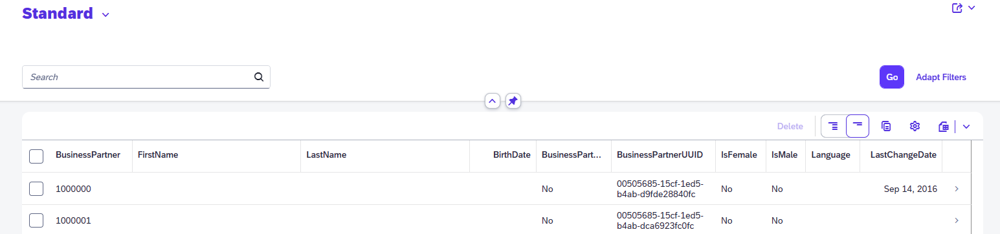

# Quest 3 - The inner dev loop: Run your app in your dev environment

Even when teams build a cloud-native application, the individual developers need their own development to code and test changes in isolation. The procedure of coding, testing, coding, testing (and so on) is often called the "inner dev loop" and will be repeated by a developer until a task is finalized and changes are submitted to the code repository to get shipped to end customers (which will be up to the "outer dev loop").

In this quest, you will set up and test your own development environment for your own inner dev loop. You will start by setting a couple of environment parameters to connect to the (external) OData service, use [docker](https://www.docker.com/) to spin up a temporary database and then deploy the [CAP application](https://cap.cloud.sap/docs/about/).

## Prepare your environment configuration
  
- In the terminal, make the `src` directory your working directory.
  ```
  cd ./src
  ```

- Based on the sample file `simple.env` in the `templates` directory, create your own `.env` file. It will contain the individual parameters for your developoment configuration. 
  ```
  cp ../templates/simple.env ./.env
  ```
  
- Open your `.env` file in VS Code, and update the following parameters. Get the new values from the link provided by your coaches. 
  - `ODATA_URL`, set to value `odata-url-host` in section `sap-cap-on-azure`.
  - `SAP_CLIENT`, set to value `odata-sap-client` in section `sap-cap-on-azure`.
  - `ODATA_USERNAME`, set to value `odata-username` in section `sap-cap-on-azure`.
  - `ODATA_USERPWD`, set to value `odata-userpwd` in section `sap-cap-on-azure`.

  (Please leave all remaining properties unchanged.)

## Deploy your CAP application 

- Bring up your database with docker.

  In your `src` directory, run the following command which will bring up a PostgreSQL database running in a docker container, along with a web admin interface, Adminer:
  ```
  docker-compose -f pg.yml up -d
  ```

> [!TIP]
> <details><summary>If you are not yet familiar with docker compose...</summary>
>  
> ...you might want to know that [Docker compose](https://docs.docker.com/compose/) is a tool to run applications consisting of multiple containers. You might want to inspect `pg.yml` to see how...
>  - ...a container named `db` is created to run the PostgreSQL database, based on container image `postgres:16-alpine` (lines 2-11) and with database, user name and password specified by the properties in lines 6-8.
>  - ...a container named `adminer` (lines 12-16); it will export port `8080` to make the container accessible from external networks.
> 
> </details>

- Inspect exposed and forwarded ports. 

  In VS Code, open the Ports tab; it will show you forwardings for the two ports specified in `pg.yml`. 

  

- Open Adminer. 

  [Adminer](https://www.adminer.org/) (the predecessor of phpMyAdmin) is tool to manage a variety of different databases. In line for port `8080`, click 'Open in Browser' in the "Forwarded Address" column in VS Code. In the new tab, log in to the database running in your docker container by using the credentials specified in `pg.yml`. 
  
  

  Note there are no resources defined yet.

> [!IMPORTANT]
> Don't miss to specify `PostgreSQL` as system type.

- Compile the node.js application and install in local package repository.

  ```
  npm install
  ```

- Run the sample CAP application.

  Start the CAP application using the `cds` command. 
  ```
  cds watch
  ```

  Example output:
  ```
  $ cds watch
  [cds] - loading server from { file: 'server.js' }
  [cds-plugin-ui5] [debug] bootstrap
  
  [...]

  [cds] - server listening on { url: 'http://localhost:4004' }
  [cds] - launched at 1/23/2024, 5:46:49 PM, version: 7.4.0, in: 5.738s
  ```

  This will populate the PostgreSQL database; open the Adminer interface and / or refresh the view. See that some tables have been created and partially populated with initial data (e.g., `cds_model`):

  

  Using the Ports tab of your VS Code, open the application via its exposed port 4004.

  

  To test integration with the ODATA provider, click the link to `index.html` below "Web Applications" and follow your terminal in VS Code. 
  
  
  
  On first click, you can track the call to the REST endpoint and see the results in the browser (after that, data will be cached in the PostgreSQL db):

  

  ```
  [odata] - GET /odata/v4/api-business-partner/BusinessPartnersLocal 
  [cache] - retrieved 0 Business Partners from "cache"
  [cache] - caching Business Partners...
  [cds] - connect to s4_bp > odata-v2 {
    url: 'https://...',
    authentication: '...',
    username: '...',
    password: '...',
    path: '/sap/opu/odata/sap/API_BUSINESS_PARTNER',
    headers: { APIKey: '...' },
    queries: { 'sap-client': '...' },
    queryParameters: { 'sap-client': '...' }
  }
  [cache] - retrieved and "cached" 729 Business Partners from S/4
  }
  ```
  
## Where to next?

[ < Quest 2 ](quest2.md) - **[🏠Home](../README.md)** - [ Quest 4 >](quest4.md)

[🔝](#)
