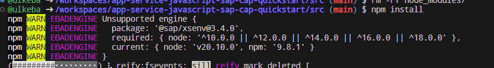
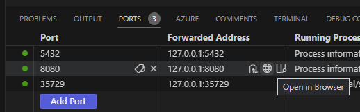
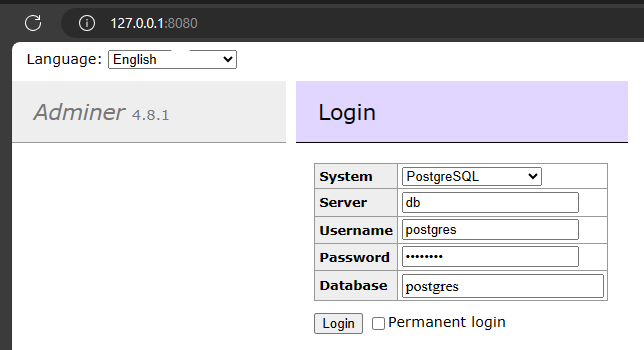
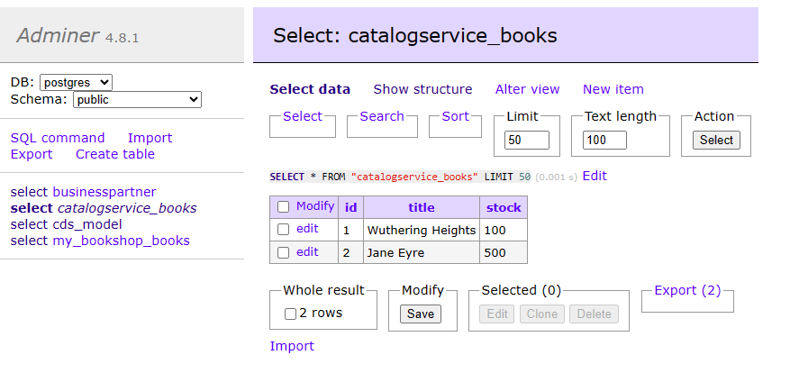
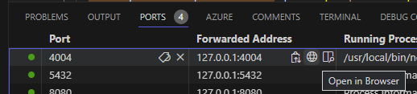
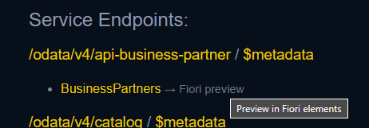
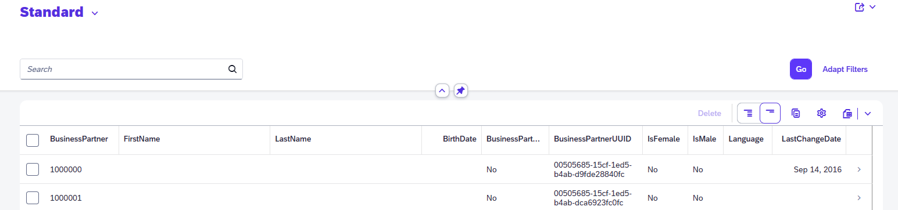

# Quest 3 - The inner dev loop: Running the code in your dev environment.

:construction: Add a link to explain the "inner dev loop".

:construction: Removed step "Start Docker engine locally". Fine?

:construction: Update Versions? (npm)
  


## Prepare your environment configuration
  
- In the terminal, make the `src` directory your working directory.
  ```
  cd ./src
  ```

- Based on the respective file in the `templates` directory, create your own `.env` file. It will contain the individual parameters for your developoment configuration. 
  ```
  cp ../templates/.env ./.env
  ```
  
- Open your `.env` file in VScode, and update the following parameters:
  - `ODATA_URL`, set to value provided by your coaches.
  - `SAP_CLIENT`, set to value provided by your coaches.
  - `ODATA_USERNAME`, set to value provided by your coaches.
  - `ODATA_USERPWD`, set to value provided by your coaches.

  (Please leave all remaining properties unchanged.)

  :construction: Will they get these credentials from the REST endpoint?

  :construction: Do we want to clean up the `.env` file (are there any obsolete properties)?

## Deploy your CAP application 

- Bring up your database with docker.

  In your `src` directory, run the following command which will bring up a PostgreSQL database running in a docker container, along with a web admin interface, Adminer:
  ```
  docker-compose -f pg.yml up -d
  ```

  :bulb: This command uses docker compose to run two different containers. If you are not yet familiar with the syntax of docker compose files, you might want to inspect `pg.yml` to see how...
  - ...a container named `db` is created to run the PostgreSQL database, based on container image `postgres:16-alpine` (lines 2-11) and with database, user name and password specified by the properties in lines 6-8.
  - ...a container named `adminer` (lines 12-16); it will export port `8080` to make the container accessible from external networks.

- Inspect exposed and forwarded ports. 

  In VSCode, open the Ports tab; it will show you forwardings for the two ports specified in `pg.yml`. 

  

  :point_up: If you use VSCode in your browser, the 'Forwarded Address' will be a FQDN like `https://automatic-disco-qx64496pq4f4r-8080.app.github.dev/` instead of `127.0.0.1:8080` as shown in this screenshot.


- Open the DB admin interface. 

  Open Adminer in your browser by pressing the 'Open in Browser' in the Ports tab of VScode. In the new tab, log in to the database running in your docker container by using the credentials specified in `pg.yml`. 
  
  :point_up: Don't miss to specify `PostgreSQL` as system type.

  

  Note there are no resources defined yet.

- Compile the node.js application and install in local package repository.

  ```
  npm install
  ```

- Run the sample CAP application.

  Start the CAP application using the `cds` command. 
  ```
  cds watch
  ```

  This will populate the PostgreSQL database; open the Adminer interface and / or refresh the view. See that four tables have been created and partially populated with initial data (e.g., `catalogservice_books`):

  

  Using the Ports tab of your VSCode, open the application via its exposed port 4004.

  

  To test integration with the ODATA provider, click `BuisinessPartners` or `Fiori preview` and follow your terminal in VSCode. 
  
  
  
  On first click, you can track the change to the REST endpoint and see the results in the browser (after that, data will be cached in the PostgreSQL db):

  

  ```
  [odata] - > READ BusinessPartners {
    '$count': 'true',
    '$select': 'AcademicTitle,AdditionalLastName,BirthDate,BusPartNationality,  BusinessPartner,BusinessPartnerBirthName,BusinessPartnerBirthplaceName,  BusinessPartnerCategory,BusinessPartnerIsBlocked,BusinessPartnerType,  BusinessPartnerUUID,FirstName,IsFemale,IsMale,Language,LastChangeDate,  LastChangeTime,LastChangedByUser,LastName,MiddleName',
    '$skip': '0',
    '$top': '30'
  }
  [cds] - connect to s4_bp > odata-v2 {
    url: 'https://...',
    authentication: '...',
    username: '...',
    password: '...',
    path: '/sap/opu/odata/sap/API_BUSINESS_PARTNER',
    headers: { APIKey: '...' },
    queries: { 'sap-client': '...' },
    queryParameters: { 'sap-client': '...' }
  }
  ```
  
  :construction: Books view won't show up anything because the default view does not contain columns. That might be confusing. Do we want to change that?

## Where to next?

[ < Quest 2 ](quest2.md) - **[🏠Home](../README.md)** - [ Quest 4 >](quest4.md)

[🔝](#)
