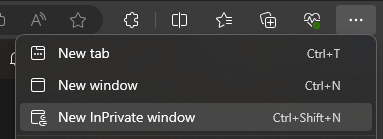
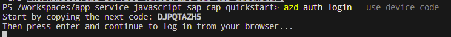
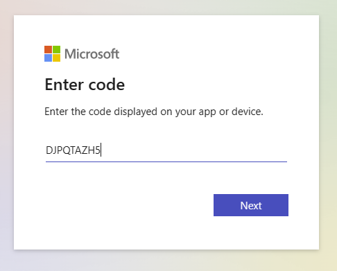

# Quest 4 - Deploy to Azure

:construction: Introduction here.
- So far: Developed in our development environment.
- Now: Deploy to the cloud, make application available.
- In this step: 
  - Get your credentials to log in to the Azure Portal.
  - Log in via Azure Development CLI.
  - Deploy infra in "one shot".

:construction: Enable alpha-feature of azd to have RG-deployment?

## Explore the Azure Portal 

- Open the Rest Endpoint and find values `azure_username` and `azure_password`.

  :construction: Adjust values.

- :point_up: To not mess with your existing logins to Azure AD, open a new Private / Incognito browser window. 

  

- In the new private browser tab, go to the [Azure Portal (https://portal.azure.com)](https://portal.azure.com) and log in using the credentials you found above.

  :point_up: If you are asked to provide further security information, please click "Ask later" to skip.

- Navigate to "Resource groups". There are different way to do that:
  - Click the hamburger icon in the upper left corner, select "Resource groups" from the menu.
  - In the search bar, type "Resource groups" and select it from the "Services" section.
  - Select the "Resoruce groups" button from the landing page.

  :bulb: A [resource group](https://learn.microsoft.com/en-us/azure/cloud-adoption-framework/ready/azure-setup-guide/organize-resources) is a container that will hold all resources that constitute your application -- such as the database, the virtual networking components and the Azure Function to host your application code.

- Locate the resource group having the name of your username.

  

## Login from your development terminal

- Go back to your VSCode in your codespace. 

- Open [https://microsoft.com/devicelogin](https://microsoft.com/devicelogin) in the private browser.

- Log in using Azure Developer CLI. Once the 9-character login code is displayed, copy that over to the login page you opened in the former step and select your account.

  ```
  azd auth login --use-device-code
  ```

  

  

  :point_up: Once you completed the login procedure, you might need to hit Enter in the terminal.


## Setup your environment configuration


- In the terminal, switch into the `azd-rg` directory of your workspace.

  ```
  cd $CODESPACE_VSCODE_FOLDER/azd-rg
  ```

- Create a new Azure Developer CLI [environment](https://learn.microsoft.com/en-us/azure/developer/azure-developer-cli/faq#what-is-an-environment-name). The environment will contain all parameters that are required to deploy the application to Azure and connect to the OData service.

  ```
  azd env new [Put your user  name here]
  ```
  e.g.,

  ```
  azd env new mhp-1
  ```

- Specify the properties:
  ```
  azd env new [YOUR USER NAME HERE, e.g. mhp-1] 
  azd env set AZURE_RESOURCE_GROUP [YOUR USER NAME HERE, e.g. mhp-1]
  azd env set AZURE_SUBSCRIPTION_ID "..."
  azd env set AZURE_LOCATION "westeurope"

  azd env set ODATA_URL "..."
  azd env set ODATA_SAP_CLIENT "..."
  azd env set ODATA_USERNAME "..."
  azd env set ODATA_USERPWD "..."
  ```

  If you want, confirm these values are written correctly by listing them:
  ```
  azd env get-values
  ```

## Deploy the application


- Deployment option 1: Do the "one shot deployment"

 - Deploy your application by running command 

    ```
    azd up
    ```
    :bulb: Behind the scenes, `azd up` will perform three steps for you:
    - `azd package`, to build and package your application code.
    - `azd provision`, to deploy the Azure resources as defined in the IaC artifacts.
    - `azd deploy`, to deploy the packaged application to Azure.
    
    :point_up: The "three step deployment" in the other deployment option will run these three steps separately. 

- Deployment option 2: Do the "three step deployment"

  - Build and package your application code. 
    ```
    azd package
    ```

    Example output:
    ```
    $ azd package

    Packaging services (azd package)

      (✓) Done: Packaging service sap-cap-api
      - Package Output: /tmp/  app-service-javascript-sap-cap-quickstart-sap-cap-api-azddeploy-1705300477.zip

    SUCCESS: Your application was packaged for Azure in 3 seconds.
    ```

  - Deploy the Azure resources defined as [Infrastructure as Code (IaC)](https://learn.microsoft.com/en-us/azure/cloud-adoption-framework/ready/considerations/infrastructure-as-code) in the `.bicep` files in the `infra` directory.

    ```
    azd provision
    ```

    When prompted, specify the target of your deployment in Azure:
    - Select the only available subscription as target subscription.
    - Select "(Europe) West Europe (westeurope)" as target region.
      :construction: We'd need to confirm resource quotas.
    - Seect the only available resource group as target resource group.

    Example output:
    ```
    $ azd package

    Provisioning Azure resources (azd provision)
    Provisioning Azure resources can take some time.
    
    
    Subscription: [SELECT YOUR TARGET SUBSCRIPTION HERE]
    Location: [SELECT YOUR TARGET REGION HERE]
    
      You can view detailed progress in the Azure Portal:
      https://portal.azure.com/#view/HubsExtension/DeploymentDetailsBlade...
    
      (✓) Done: App Service plan: plan-kt6nr4qdrsqss
      (✓) Done: Log Analytics workspace: log-kt6nr4qdrsqss
      (✓) Done: Key Vault: kv-kt6nr4qdrsqss
      (✓) Done: Application Insights: appi-kt6nr4qdrsqss
      (✓) Done: Portal dashboard: dash-kt6nr4qdrsqss
      (✓) Done: App Service: app-api-kt6nr4qdrsqss
    Retrieving CosmosDB for PSQL (citus) FQDN...
    Storing CosmosDB for PSQL (citus) FQDN as POSTGRES_HOSTNAME in azure app      settings...
    App settings have been redacted. Use `az webapp/logicapp/functionapp config appsettings list` to view.

    [...]
    
    SUCCESS: Your application was provisioned in Azure in 3 minutes 44 seconds.
    You can view the resources created under the resource group mhp-1 in Azure Portal:
    https://portal.azure.com/#@/resource/subscriptions/...

    ```

  - Deploy the application packaged in the first step to the resources deployed in Azure.

    ```
    azd deploy
    ```

    Example output:
    ```
    $ azd deploy

    Deploying services (azd deploy)
    
      (✓) Done: Deploying service sap-cap-api
      - Endpoint: https://app-api-kt6nr4qdrsqss.azurewebsites.net/
    
    
    SUCCESS: Your application was deployed to Azure in 7 minutes 43 seconds.
    You can view the resources created under the resource group mhp-1 in Azure Portal:
    https://portal.azure.com/#@/resource/subscriptions/...

    ```
  
## Inspect the deployment in Azure

- Go back to the Azure portal and browse to your resource group.

- Confirm a set of resources have been deployed to host your application.

  

- The resource of type "App Service" is hosting your application. Open that one up and locate the URL endpoint for this application.

  

- Open the application by clicking the link behing "Default domain" and do a first smoke test of your application.

  


## Where to next?

[ < Quest 3 ](quest3.md) - **[🏠Home](../README.md)** - [ Quest 5 >](quest5.md)

[🔝](#)


