# Quest 4 - Deploy your application to Azure

In this quest, you will bring your application to the Azure cloud to make it available to your favorite users. You will get credentials to log in to Azure's management portal and deploy all components to ...
- ...host your application,
- ...host your database,
- ...securely store credentials in a vault,
- ...observe your application with monitoring dashboards.


## Explore the Azure Portal 

- Open the Rest Endpoint and find values `azure_username` and `azure_password`.

  :construction: Add URL, adjust values.

- Open a new browser tab, go to the [Azure Portal (https://portal.azure.com)](https://portal.azure.com) and log in using the credentials you found above.

  :point_up: If you are asked to provide further security information, please click "Ask later" to skip.

- Navigate to "Resource groups". There are different way to do that:
  - Click the hamburger icon in the upper left corner, select "Resource groups" from the menu.
  - In the search bar, type "Resource groups" and select it from the "Services" section.
  - Select the "Resoruce groups" button from the landing page.

  :bulb: A [resource group](https://learn.microsoft.com/en-us/azure/cloud-adoption-framework/ready/azure-setup-guide/organize-resources) is a container that will hold all resources that constitute your application -- such as the database, the virtual networking components and the Azure Function to host your application code.

- Locate the resource group having the name of your username.

  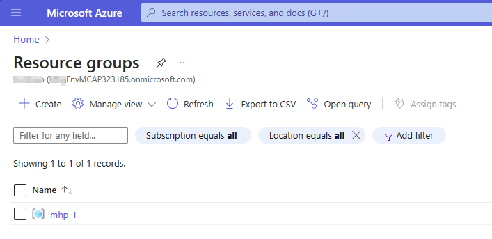

## Login from your development terminal

:point_up: Two different CLIs

- Go back to your VS Code in your codespace. To login in to both, the Azure CLI (`az`) and the Azure Developer CLI (`azd`).

- Log in using Azure CLI; follow the instructions to go confirm your identity in the browser.

  ```
  az login --use-device-code
  ```

  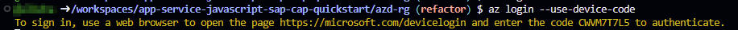

  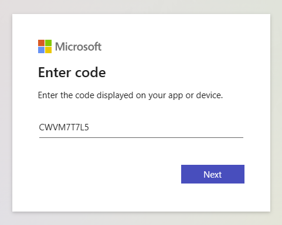

  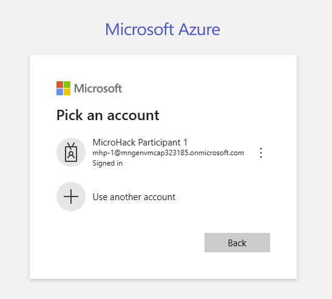

- Do the same exercise for the Azure Developer CLI. 

  ```
  azd auth login --use-device-code
  ```

## Setup your environment configuration


- In the terminal, switch into the `azd-rg` directory of your workspace.

  ```
  cd $CODESPACE_VSCODE_FOLDER/azd-rg
  ```

- Create a new Azure Developer CLI [environment](https://learn.microsoft.com/en-us/azure/developer/azure-developer-cli/faq#what-is-an-environment-name). The environment will contain all parameters that are required to deploy the application to Azure and connect to the OData service.

  ```
  azd env new [Put your user  name here]
  ```
  e.g.,

  ```
  azd env new mhp-1
  ```

- Specify the properties:
  ```
  azd env new [YOUR USER NAME HERE, e.g. mhp-1] 
  azd env set AZURE_RESOURCE_GROUP [YOUR USER NAME HERE, e.g. mhp-1]
  azd env set AZURE_SUBSCRIPTION_ID "..."
  azd env set AZURE_LOCATION "westeurope"

  azd env set ODATA_URL "..."
  azd env set ODATA_SAP_CLIENT "..."
  azd env set ODATA_USERNAME "..."
  azd env set ODATA_USERPWD "..."

  azd env set APP_USE_ENTRAID_AUTHENTICATION "false"
  ```

  :construction: We'd need to confirm resource quotas.

  :bulb: If you want, confirm these values are written correctly by listing them:
  ```
  azd env get-values
  ```

## Deploy the application


- Deployment option 1: Do the "one shot deployment"

 - Deploy your application by running command 

    ```
    azd up
    ```
    :bulb: Behind the scenes, `azd up` will perform three steps for you:
    - `azd package`, to build and package your application code.
    - `azd provision`, to deploy the Azure resources as defined in the IaC artifacts.
    - `azd deploy`, to deploy the packaged application to Azure.
    
    :point_up: The "three step deployment" in the other deployment option will run these three steps separately. 

- Deployment option 2: Do the "three step deployment"

  - Build and package your application code. 
    ```
    azd package
    ```

    Example output:
    ```
    $ azd package

    Packaging services (azd package)

      (✓) Done: Packaging service sap-cap-api
      - Package Output: /tmp/  app-service-javascript-sap-cap-quickstart-sap-cap-api-azddeploy-1705300477.zip

    SUCCESS: Your application was packaged for Azure in 3 seconds.
    ```

  - Deploy the Azure resources defined as [Infrastructure as Code (IaC)](https://learn.microsoft.com/en-us/azure/cloud-adoption-framework/ready/considerations/infrastructure-as-code) in the `.bicep` files in the `infra` directory.

    ```
    azd provision
    ```

    Example output:
    ```
    $ azd provision

    Provisioning Azure resources (azd provision)
    Provisioning Azure resources can take some time.
    
    
    Subscription: [SELECT YOUR TARGET SUBSCRIPTION HERE]
    Location: [SELECT YOUR TARGET REGION HERE]
    
      You can view detailed progress in the Azure Portal:
      https://portal.azure.com/#view/HubsExtension/DeploymentDetailsBlade...
    
      (✓) Done: App Service plan: plan-kt6nr4qdrsqss
      (✓) Done: Log Analytics workspace: log-kt6nr4qdrsqss
      (✓) Done: Key Vault: kv-kt6nr4qdrsqss
      (✓) Done: Application Insights: appi-kt6nr4qdrsqss
      (✓) Done: Portal dashboard: dash-kt6nr4qdrsqss
      (✓) Done: App Service: app-api-kt6nr4qdrsqss
    Retrieving CosmosDB for PSQL (citus) FQDN...
    Storing CosmosDB for PSQL (citus) FQDN as POSTGRES_HOSTNAME in azure app settings...
    App settings have been redacted. Use `az webapp/logicapp/functionapp config appsettings list` to view.

    [...]
    
    SUCCESS: Your application was provisioned in Azure in 3 minutes 44 seconds.
    You can view the resources created under the resource group mhp-1 in Azure Portal:
    https://portal.azure.com/#@/resource/subscriptions/...

    ```

  - Deploy the application packaged in the first step to the resources deployed in Azure.

    ```
    azd deploy
    ```

    Example output:
    ```
    $ azd deploy

    Deploying services (azd deploy)
    
      (✓) Done: Deploying service sap-cap-api
      - Endpoint: https://app-api-kt6nr4qdrsqss.azurewebsites.net/
    
    
    SUCCESS: Your application was deployed to Azure in 7 minutes 43 seconds.
    You can view the resources created under the resource group mhp-1 in Azure Portal:
    https://portal.azure.com/#@/resource/subscriptions/...

    ```
  
## Inspect the deployment in Azure

- Go back to the Azure portal and browse to your resource group.

- Confirm a set of resources have been deployed to host your application.

  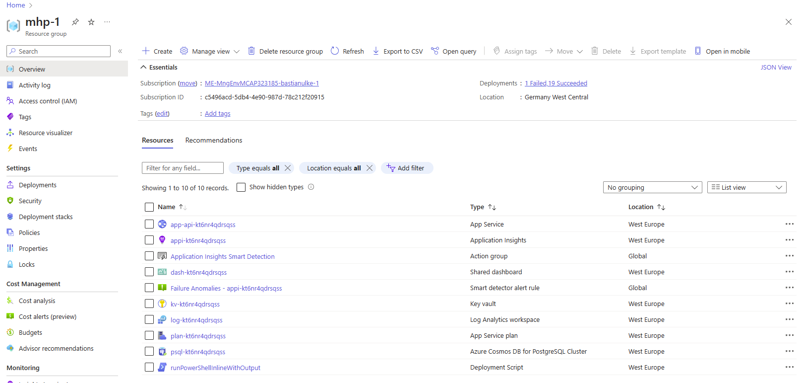

- The resource of type "App Service" is hosting your application. Open that one up and locate the URL endpoint for this application.

  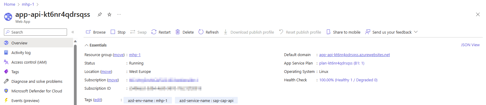

- Open the application by clicking the link behing "Default domain" and do a first smoke test of your application.

  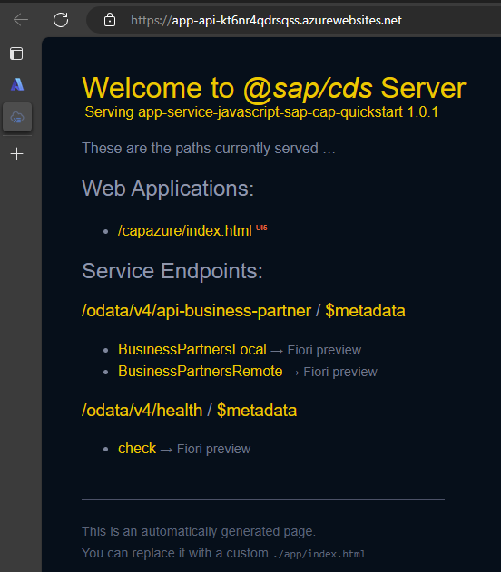

- Click 'BusinessPartnersLocal' to retrieve some data from the OData service.

  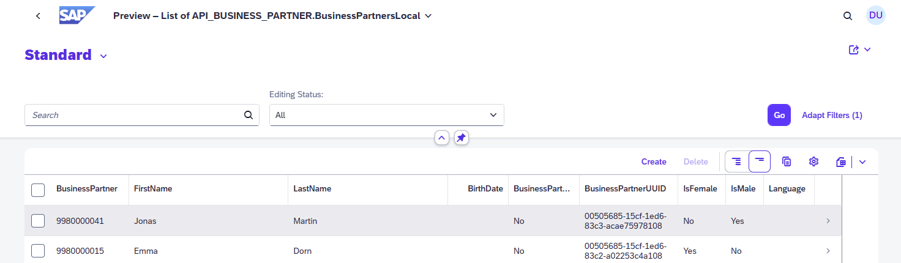


## Further exploration


### Inspect pre-defined dashboards

As part of the infrastructure provisioning step, any `azd` project will come with monitoring tooling built-in. The tooling is built on different services from the [Azure Monitor](https://learn.microsoft.com/en-us/azure/azure-monitor/overview) family:

- [Application Insights](https://learn.microsoft.com/azure/azure-monitor/app/app-insights-overview?tabs=net)
- [Application Insights Dashboards](https://learn.microsoft.com/azure/azure-monitor/app/overview-dashboard)
- [Log Analytics](https://learn.microsoft.com/azure/azure-monitor/logs/log-analytics-overview)

The setup comes with three basic dashboards that you can access via the portal or via `azd` commands:

  - Main dashboard: 
    ```
    azd monitor --overview
    ```

  - Live metrics dashboard:
    ```
    azd monitor --live
    ```

    :construction: Shows me 'No Data'.

  - Log datasink:
    ```
    azd monitor --logs
    ```

This gives you a solid starting point for monitoring your application as well as troubleshooting it.

### Connect to cloud-hosted PostgreSQL database

To store application data, an instance of [Azure Cosmos DB for PostgreSQL documentation](https://learn.microsoft.com/en-us/azure/cosmos-db/postgresql/) was deployed in the Azure cloud. As this application exposes the APIs of a common PostgreSQL database, you can use any existing application or administration tool that supports PostgreSQL databases to connect to the database. 

- Open the Adminer interface again as you did in [quest 3](quest3.md).

- In the Azure Portal, browse to the resource of type "Azure Cosmos DB for PostgreSQL Cluster" in your resource group; this resource represents your database cluster. Copy the FQDN specified as "Coordinator name" to your clipboard and paste in the "host" field of your Adminer login page.

  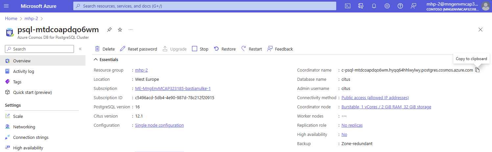

- The secret password for the admin username has been stored in the Key Vault resource in your resource group.  Browse to your vault, open the "Secrets" blade and select item `kv-secret-cosmosdb-password`. 

  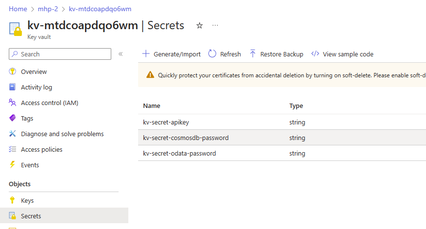

  Klick the id of the "Current Version" and copy the secret value to your clipoard.

  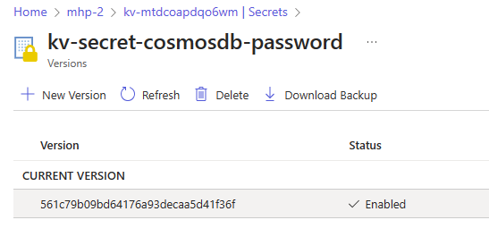

  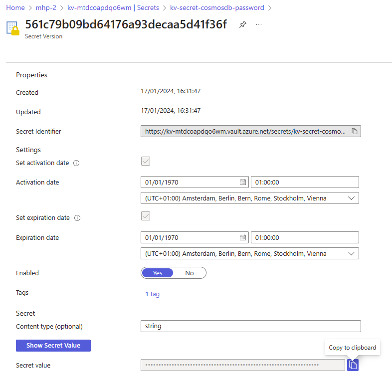

- Login to your cloud-hosted database using Adminer

  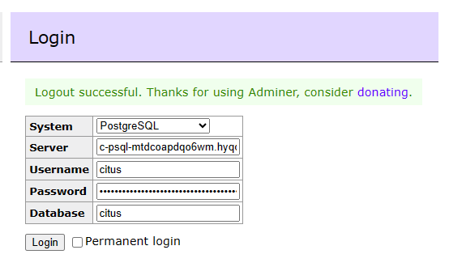

  ...and select table `businesspartnerlocal` and click select to verify data from OData service got loaded into the database:

  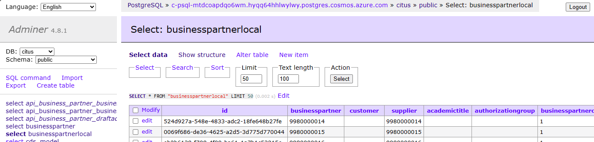

  :point_up: If the table is empty, you might not yet have triggerd data population from the OData service by launching the BusinessPartnersLocal Fiori application from your application landing page.


### Security

To ensure security an application you deploy to Azure, one crucial point is to protect access credentials for backend components. Azure therefore offers two major capabilities:
- Use [Azure Key Vault](https://learn.microsoft.com/azure/key-vault/general/overview) as central storage for all Keys, Secrets and Certificates for applications hosted on the Azure cloud.
- Completely avoid access credentials by using [managed identities](https://learn.microsoft.com/azure/active-directory/managed-identities-azure-resources/overview) and rely on the Azure platform to handle authentication of backend services for you.

#### Exploring the Key Vault

- Open your Key Vault resource. 

- In the "Objects" section, select the "Secrets" blade. It will list four secrets (like passwords or API keys) stored in the vault.

  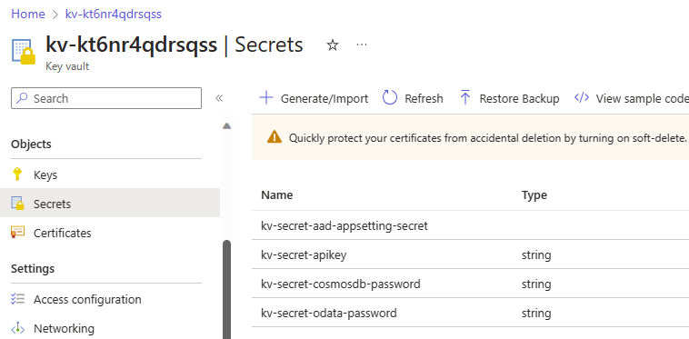

- For example, klick "kv-secred-odata-password", and the opening page, click the latest secret version.

  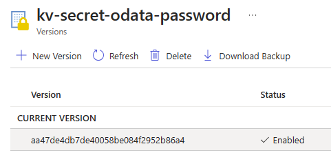

- This will show you some meta data and, at the bottom of the page, a button to show the secret value:

  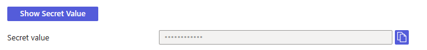

#### Exploring the App Service Managed Identity

- Open your App Service resource and browse to the "Identity" blade in the "Settings" seciton. Verify the state is "On".

  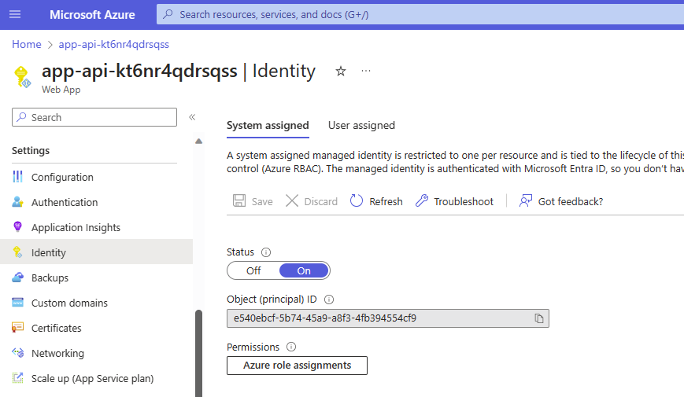

  :bulb: With that, the application (including your custom-code) can rely on platform capabilities to access other Azure resources. 

- Open the "Configuration" blade; the "Application Settings" lists all parameters that will be supplied to your application as environment variables. To explore the values, click the "Show values" button.

  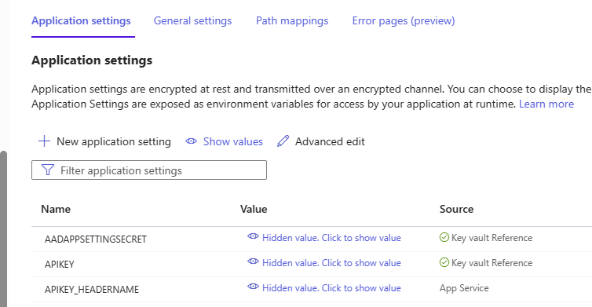

- Explore the settings that contain secret values (e.g., `ODATA_USERPWD`); instead of specifying the value explicity, it refers to your Azure Key Vault. 

  :point_up: Note that this refernece does not contain a password to authenticate access from the App Service -- it only holds a resource to the specific secret.

  ```
  @Microsoft.KeyVault(SecretUri=https://kv-kt6nr4qdrsqss.vault.azure.net/secrets/kv-secret-odata-password)
  ```

- Go to the Key Vault and open the "Access policies" blade. You see that the Key Vault uses the App Service's managed identity to authorize access.

  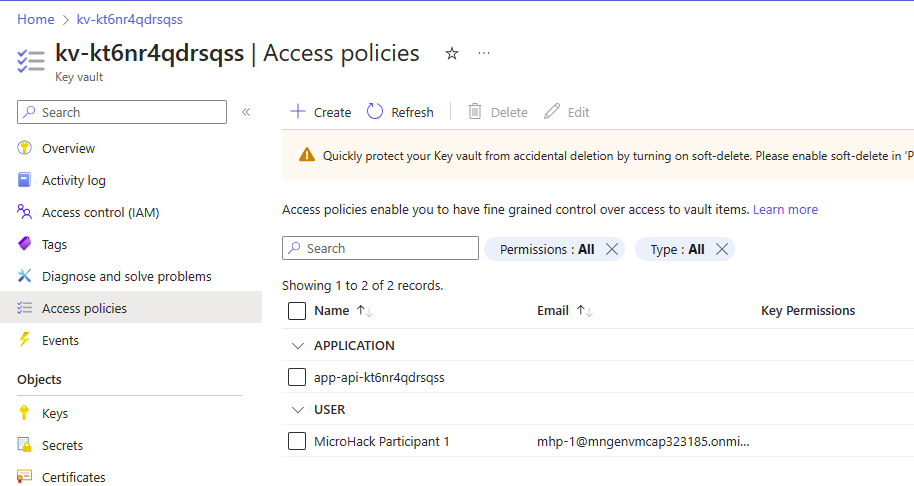


### Inspect the application log
As managed service, the "App Service" resource hosting your application comes with a lot of platform-managed capabilities. For example, you can easily inspect the log information written from your console. 

- Typically, there are different paths to achieve the same goal. One way to view the application log is to open the Azure Portal, browse to App Service resource and open up the "Logstream" blade in the "Monitoring" section:

  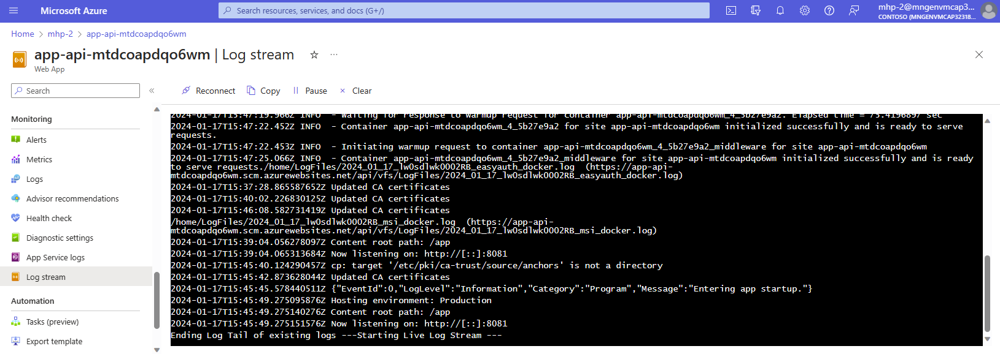

- For automation or if you feel more comfortable using the command-line interface (CLI), you can equally invoke the command 

  ```
  az webapp log tail --resource-group [YOUR RESOURCE GROUP NAME HERE] --name [YOUR APP SERVICE NAME HERE]
  ```

  :construction: Is there really no way to get a specific value out of the env? That would allow us to replace the [..] replaceholders with variables.


## Further remarks

### Network segmentation and security

In the last steps, you have seen that you can easily connect to your web application, the database and the key vault via public internet. We have selected this unbound access to simplify the setup for this demo. Effectively, you have a wide range of opportunities to protect your resources from unauthorized access by introducing network restrictions:

- Service firewalls can be enabled for many services, including [Azure Cosmos DB for PostgreSQL](https://learn.microsoft.com/en-us/azure/cosmos-db/postgresql/howto-manage-firewall-using-portal) and [Azure Key Vault](https://learn.microsoft.com/en-us/azure/key-vault/general/network-security).

- With the help of [Private Endpoints](https://learn.microsoft.com/en-us/azure/private-link/private-endpoint-overview), Azure services can be assigned IP addresses from your internal virtual networks, thereby restricting any inbound access from public internet.

- Finally, we have general guidelines on how to securely set up your network in the cloud in our [Azure Architecture Center](https://learn.microsoft.com/en-us/azure/architecture/), [Cloud Adoption Framework](https://learn.microsoft.com/en-us/azure/cloud-adoption-framework/) and [Well-Architected Framework](https://learn.microsoft.com/en-gb/azure/well-architected/). For example [Secure and govern workloads with network-level segmentation](https://learn.microsoft.com/en-us/azure/architecture/reference-architectures/hybrid-networking/network-level-segmentation).


## Where to next?

[ < Quest 3 ](quest3.md) - **[🏠Home](../README.md)** - [ Quest 5 >](quest5.md)

[🔝](#)


