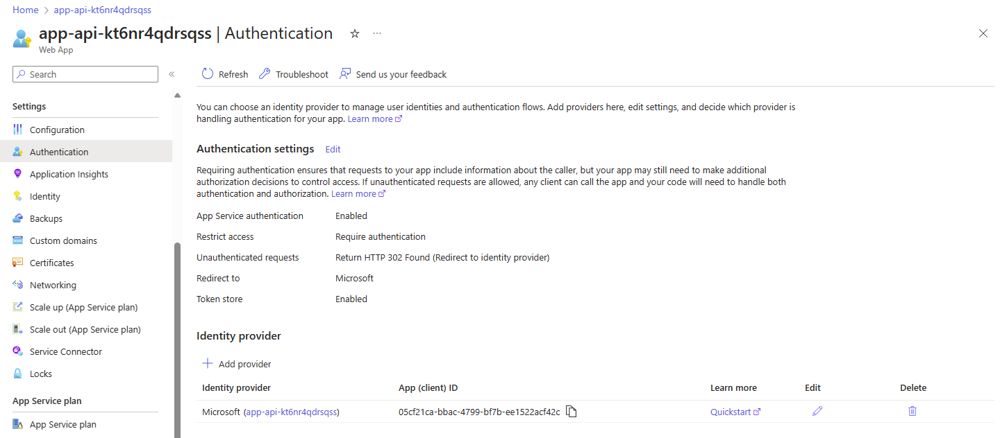
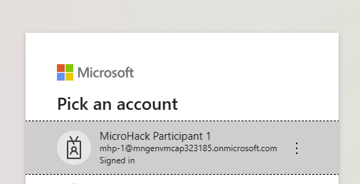
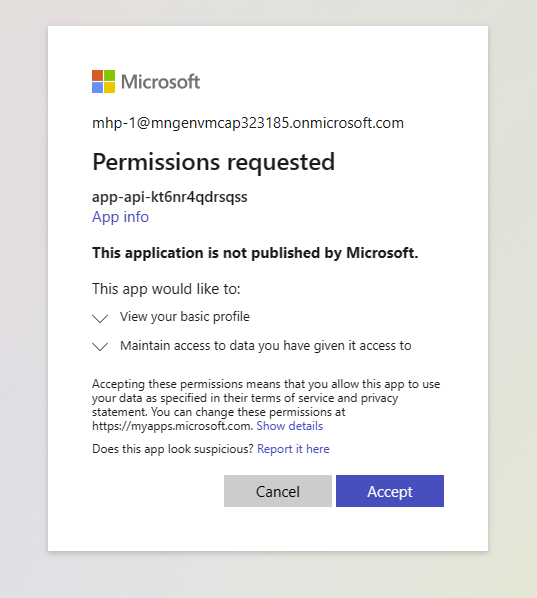

# Quest 5 - Protect your app with user authentication

So far, your application is open to anyone on the internet and does not require any user authentication. In this quest, you will make authentication required for any user interaction. Instead of implementing your own dedicated user management and authentication code, you will enable [OAuth 2.0 authorization with Microsoft Entra ID](https://learn.microsoft.com/en-us/entra/architecture/auth-oauth2) for your application to allow users to log in with their corporate Entra identity.


## Enable Authentication on App Service and redeploy your application

- Set property.

  ```
  azd env set APP_USE_ENTRAID_AUTHENTICATION true
  ```

- Re-trigger the provisioning of the application infrastructure by running the respective `azd` command.

  ```
  azd provision
  ```

  Example output:

  ```
  $ azd provision

  Creating web app Entra ID app registration...
  Generating secret for app registration...
  Storing app registration secret in key vault...
  Adding Authentication settings to Azure App Service...
  Setting the authentication settings for the webapp in the v2 format, overwriting any existing settings...
  
  [...]
  
  SUCCESS: Your application was provisioned in Azure in 4 minutes 13 seconds.
  You can view the resources created under the resource group mhp-1 in Azure Portal:
  https://portal.azure.com/#@/resource/subscriptions/.../resourceGroups/mhp-1/overview
  ```

> [!TIP]
> <details><summary>While the infrastructure is provisioned...</summary>
>  
> ...you might want to take a glimpse at the code to follow the data flow of this parameter:
> - We have added the parameter `APP_USE_ENTRAID_AUTHENTICATION` to the AZD environment with value `true`.
> - During infrastructure provisioning, `azd provision` will refer to file `infra/app.parameters.json`  and perform an [input parameter > substitution](https://learn.microsoft.com/en-us/azure/developer/azure-developer-cli/manage-environment-variables). This means, that `$> {APP_USE_ENTRAID_AUTHENTICATION}` will be repalced with `true`:
>   ```json
>   {
>     "parameters": {
>       ...
>       "useEntraIDAuthentication": {
>         "value": "${APP_USE_ENTRAID_AUTHENTICATION}"
>       }
>     }
>   }
>   ```
> - The values specified in `infra/app.parameters.json` will be applied to `infra/app.bicep` to determine the target values for all resource > configurations; see the parameter definition in the top section of the file:
>   ```bicep
>   @description('Flag to use Entra ID authentication feature of Azure App Service')
>   param useEntraIDAuthentication bool = false
>   ```
> - Also, it will be used in the PowerShell script `handleAzureAuthAndDBConnectionString.ps1` in the `hooks` folder to control some configuration > parameters after infrastructure provisioning. 
>   ```
>   if ($env:USE_EntraIDAuthentication -eq "false") {
>     ...
>   ```
> 
> </details>

- Once the `azd provision` has terminated, trigger a re-deployment of your application.

  ```
  azd deploy
  ```

  Example output: 
  ```
  $ azd deploy

  Deploying services (azd deploy)
  
    (✓) Done: Deploying service sap-cap-api
    - Endpoint: https://app-api-kt6nr4qdrsqss.azurewebsites.net/
  
  
  SUCCESS: Your application was deployed to Azure in 7 minutes 43 seconds.
  You can view the resources created under the resource group mhp-1 in Azure Portal:
  https://portal.azure.com/#@/resource/subscriptions/...

  ```

## Inspect and test the authentication of your application

- While the `azd deploy` is still running, go back to the Azure protal, and open up the "Authentication" blade in the "Settings" section of your App Service resource. See, that the application will now require authentication and redirect any unauthenticated request to the identiy provider's login page.

  

- Once `azd deploy` has terminated, go back to the Overview blade and open your application again by clicking the "Default domain" link. Your application will now redirect you to the well-known Entra ID login page. After selecting your account and granting the permission to access your (test account's) profile data, the landing page of your application will open up:

  

  


  

## Where to next?

[ < Quest 4 ](quest4.md) - **[🏠Home](../README.md)** - [ Quest 6 >](quest6.md)

[🔝](#)


