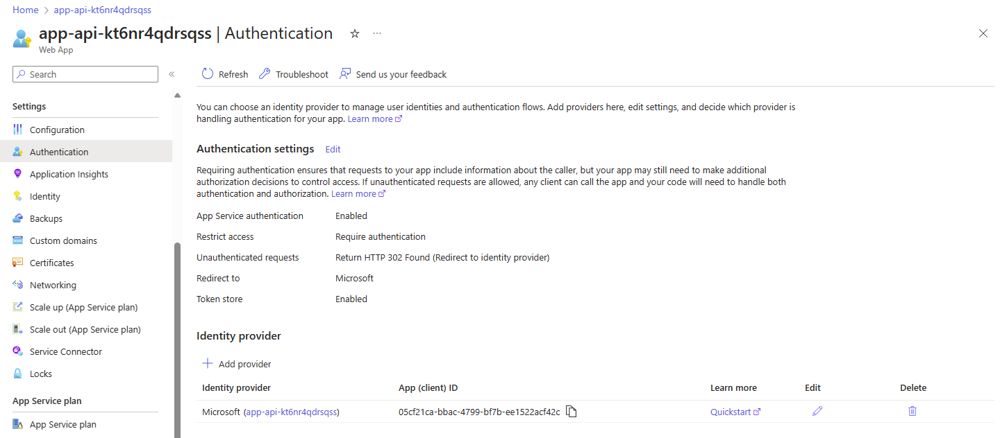
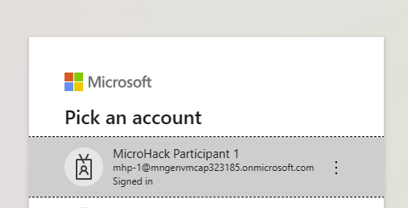
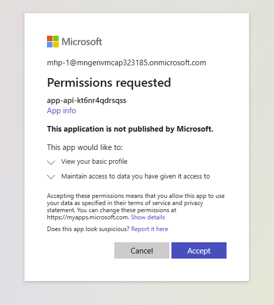

# Quest 5 - Protect your app

So far, your application is open to anyone on the internet and does not require any user authentication. In this quest, you will make authentication required for any user interaction. Instead of implementing your own dedicated user management and authentication code, you will enable [OAuth 2.0 authorization with Microsoft Entra ID](https://learn.microsoft.com/en-us/entra/architecture/auth-oauth2) for your application to allow users to log in with their corporate Entra identity.


## Enable Authentication on App Service and redeploy your application

- Set property.

  ```
  azd env set APP_USE_ENTRAID_AUTHENTICATION true
  ```

- Re-trigger the provisioning of the application infrastructure by running the respective `azd` command.

  ```
  azd provision
  ```

  Example output:

  ```
  $ azd provision

  Creating web app Entra ID app registration...
  Generating secret for app registration...
  Storing app registration secret in key vault...
  Adding Authentication settings to Azure App Service...
  Setting the authentication settings for the webapp in the v2 format, overwriting any existing settings...
  
  [...]
  
  SUCCESS: Your application was provisioned in Azure in 4 minutes 13 seconds.
  You can view the resources created under the resource group mhp-1 in Azure Portal:
  https://portal.azure.com/#@/resource/subscriptions/.../resourceGroups/mhp-1/overview
  ```

> [!TIP]
> <details><summary>While the infrastructure is being provisioned...</summary>
>  
> ...you might want to take a glimpse at the code to follow the data flow of this parameter:
> - We have added the parameter `APP_USE_ENTRAID_AUTHENTICATION` to the AZD environment with value `true`.
> - During infrastructure provisioning, `azd provision` will refer to file `infra/app.parameters.json`  and perform an [input parameter > substitution](https://learn.microsoft.com/en-us/azure/developer/azure-developer-cli/manage-environment-variables). This means, that `$> {APP_USE_ENTRAID_AUTHENTICATION}` will be repalced with `true`:
>   ```json
>   {
>     "parameters": {
>       ...
>       "useEntraIDAuthentication": {
>         "value": "${APP_USE_ENTRAID_AUTHENTICATION}"
>       }
>     }
>   }
>   ```
> - The values specified in `infra/app.parameters.json` will be applied to `infra/app.bicep` to determine the target values for all resource > configurations; see the parameter definition in the top section of the file:
>   ```bicep
>   @description('Flag to use Entra ID authentication feature of Azure App Service')
>   param useEntraIDAuthentication bool = false
>   ```
> - Also, it will be used in the PowerShell script `handleAzureAuthAndDBConnectionString.ps1` in the `hooks` folder to control some configuration > parameters after infrastructure provisioning. 
>   ```
>   if ($env:USE_EntraIDAuthentication -eq "false") {
>     ...
>   ```
> 
> </details>

- Once the `azd provision` has terminated, trigger a re-deployment of your application.

  ```
  azd deploy
  ```

  Example output: 
  ```
  $ azd deploy

  Deploying services (azd deploy)
  
    (✓) Done: Deploying service sap-cap-api
    - Endpoint: https://app-api-kt6nr4qdrsqss.azurewebsites.net/
  
  
  SUCCESS: Your application was deployed to Azure in 7 minutes 43 seconds.
  You can view the resources created under the resource group mhp-1 in Azure Portal:
  https://portal.azure.com/#@/resource/subscriptions/...

  ```

## Inspect and test the authentication of your application

- While the `azd deploy` is still running, go back to the Azure protal, and open up the "Authentication" blade in the "Settings" section of your App Service resource. See, that the application will now require authentication and redirect any unauthenticated request to the identiy provider's login page.

  

- Once `azd deploy` has terminated, go back to the Overview blade and open your application again by clicking the "Default domain" link. Your application will now redirect you to the well-known Entra ID login page. After selecting your account and granting the permission to access your (test account's) profile data, the landing page of your application will open up:

  

  


## Towards role-based user authorization

Authenticating the user is a necessary first step to protect your workload and data but not always sufficient. CAP allows to to implement your own role-based access control rules, while using Microsoft Entra ID to manage user permissions with application roles and group memberships. Offloading access management to Entra ID allows you to use your standardized IAM workflows and benefit from capabilities like [access reviews](https://learn.microsoft.com/en-us/entra/id-governance/access-reviews-overview) for your application.

You can find more guidance in the documentation of the npm package [cds-entra-id](https://www.npmjs.com/package/cds-entra-id) or in the project documentation [here](https://github.com/Azure-Samples/app-service-javascript-sap-cap-quickstart/blob/main/documentation/AUTHENTICATION.md).

## Towards SAP Principal propagation

In the interest of time and simplicity, we have been using a single account to connect to the backing SAP system via OData. In an enterprise-grade scenario, you will want to use the individual user's identity to access the OData service to query or change data. This requires your application to map the user's Entra identity to his / her identity in the SAP system. You can achieve this with the help of SAP Principal Propagation and Azure API Management (APIM) as described [here](https://learn.microsoft.com/azure/api-management/sap-api#production-considerations). 

> [!TIP]
> The sample code in the repostiory allows you include API management in your deployment and enable principal propagation; if you want to learn more, reach out to your coaches.

## A note on network segmentation and security

As you have seen, your App Service instance and your Key Vault (as well as your database) can be accessed from public internet. We have selected this unbound access to simplify the setup for this tutorial. Effectively, you have a wide range of opportunities to protect your resources from unauthorized access by introducing network restrictions:

- Service firewalls can be enabled for many services, including [Azure Cosmos DB for PostgreSQL](https://learn.microsoft.com/en-us/azure/cosmos-db/postgresql/howto-manage-firewall-using-portal) and [Azure Key Vault](https://learn.microsoft.com/en-us/azure/key-vault/general/network-security).

- With the help of [Private Endpoints](https://learn.microsoft.com/en-us/azure/private-link/private-endpoint-overview), Azure services can be assigned IP addresses from your internal virtual networks, thereby restricting any inbound access from public internet.

- Finally, we have general guidelines on how to securely set up your network in the cloud in our [Azure Architecture Center](https://learn.microsoft.com/en-us/azure/architecture/), [Cloud Adoption Framework](https://learn.microsoft.com/en-us/azure/cloud-adoption-framework/) and [Well-Architected Framework](https://learn.microsoft.com/en-gb/azure/well-architected/). For example [Secure and govern workloads with network-level segmentation](https://learn.microsoft.com/en-us/azure/architecture/reference-architectures/hybrid-networking/network-level-segmentation).


## Where to next?

[ < Quest 4 ](quest4.md) - **[🏠Home](../README.md)** - [ Quest 6 >](quest6.md)

[🔝](#)


