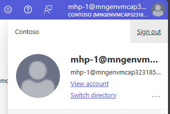

# Quest 6 - Clean up the dem environment

This is the final quest of this tutorial. We hope you enjoyed the experience and got some valuable insights from this walkthrough. Before claiming your badge, please take some final minutes to clean up all resources 

## Remove all resources

- Use `azd` to clean up your environment and delete all resources:

  ```
  azd down --purge
  ```

  Example output:
  ```
  $ azd down --purge

  Deleting all resources and deployed code on Azure (azd down)
  Local application code is not deleted when running 'azd down'.
  
  
    WARNING: Feature 'resourceGroupDeployments' is in alpha stage.
    To learn more about alpha features and their support, visit   https://aka.ms/azd-feature-stages.
  
    Resource group(s) to be deleted:
  
      • mhp-2: https://portal.azure.com/#@/resource/subscriptions/  c5496acd-5db4-4e90-987d-78c212f20915/resourceGroups/mhp-2/  overview
  
  ? Total resources to delete: 9, are you sure you want to   continue? (y/N) Yes

  Deleting your resources can take some time.

    (✓) Done: Deleting resource group: mhp-2


  SUCCESS: Your application was removed from Azure in 12 minutes 27 seconds.
  ```

- Also, don't forget to log out from the Azure Portal.

  

## Where to next?

[ < Quest 5 ](quest5.md) - **[🏠Home](../README.md)** 

[🔝](#)


