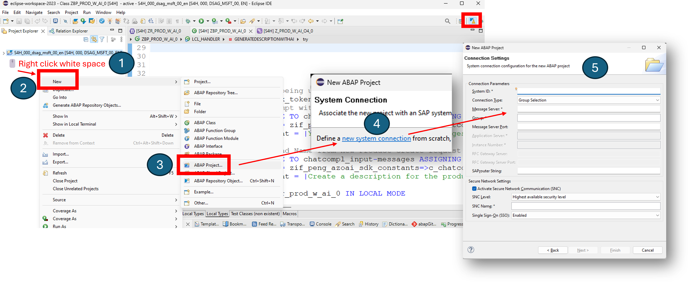

# Quest 1 - Setting up

**[🏠Home](../README.md)** - [ Quest 2 >](quest2.md)

🌟🕒 15 mins

## Introduction

In this quest you will setup your environment, start Eclipse with ABAP Development Tools (ADT), and login to your S/4HANA Cloud ABAP environment (aka embedded steampunk).

## The path

1. Make sure you have a suitable release of [Eclipse with ABAP Development Tools (ADT)](https://tools.hana.ondemand.com/#abap) installed.

> [!NOTE]
> If you don't have Eclipse yet, install it now (e.g. Eclipse IDE for Java Developers). Get ADT from the task menu `Help -> Install New Software...` and add the ABAP Development Tools update site `https://tools.hana.ondemand.com/latest`. Choose `ABAP Development Tools`.

2. Start Eclipse and switch to the ABAP perspective.
3. If you still see the "Welcome" tab, close it.
4. Move to the Project Explorer pane, click `New -> ABAP Project...`, select `new system connection` on the wizard and supply below info:

| Field | Value |
| --- | --- |
| System ID | `S4H` |
| Connection Type | `Custom Application Server` |
| Application Server | `Get IP from your dungeon master` |
| Instance Number | `00` |

Logon to your project with below info:

| Field | Value |
| --- | --- |
| User | `DSAG_MSFT_##` |
| Password | `Get password from your dungeon master` |
| Client | `000` |
| Language | `EN` |

4. Find your dedicated empty package `ZDSAG_MSFT_AI_##` in the "System Library" section in the Project Explorer, right-click and choose `Add to Favorite Packages` and open its properties view (double click on the Project Explorer item).
5. See the selected setting `ABAP for Cloud Development` for `Default ABAP Language Version` on the "General Data" section of your package. If it is not set, please set it now.

That wasn't too hard, was it? Now you are ready to start your journey.

## Where to next?

**[🏠Home](../README.md)** - [ Quest 2 >](quest2.md)

[🔝](#)
