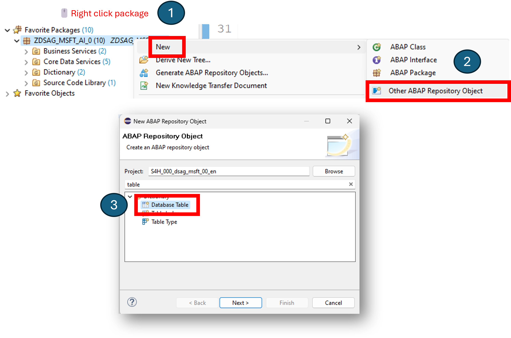

# Quest 2 - Generate RAP service and Fiori UI

[ < Quest 1 ](quest1.md) - **[🏠Home](../README.md)** - [ Quest 3 >](quest3.md)

🌟🌟🕒 30 mins

## Introduction

In this quest, you will generate an SAP RESTful ABAP Programming model service based of a provided table definition. Moreover you will generate a Fiori UI to maintain values.

## The path

### Generate RAP service

> [!IMPORTANT]
> Always save and activate your objects before testing. And don't forget to use your assigned number ## in the object names.

#### Create a new ABAP package
1. Create the package `ZDSAG_MSFT_AI_##` for this dungeon (New -> ABAP Package), ensure the package type is set to Development, and check the box `Add to favorite packages`. Choose `Next`.
2. Fill in the name `HOME` as Software Component. Choose `Finish`.
3. Assign the new package to the transport request `S4HK902222` with Description "DSAG-TechXChange".

#### Create a new database table

1. Create a new database table (New -> Other ABAP Repository Object -> Dictionary) named ZPROD_W_AI_##.
2. Find it under Dictionary -> Database Tables and double-click on it.

> [!NOTE]
> The screenshot below shows an already populated RAP service. Yours will be empty.



3. Use the table definition below to enhance the initial table definition. Make sure to replace the ## with your assigned number.

```diff
@EndUserText.label : 'Table holding Products with GenAI descriptions created'
@AbapCatalog.enhancement.category : #NOT_EXTENSIBLE
@AbapCatalog.tableCategory : #TRANSPARENT
@AbapCatalog.deliveryClass : #A
@AbapCatalog.dataMaintenance : #RESTRICTED
+define table zprod_w_ai_## {
  key client            : abap.clnt not null;
  key product_uuid      : abap.raw(16) not null;
  id                    : abap.numc(10);
  name                  : abap.char(30);
  category              : abap.char(20);
  description           : abap.char(200);
+  @Semantics.amount.currencyCode : 'zprod_w_ai_##.currency_code'
  price                 : abap.curr(16,2);
  currency_code         : abap.cuky;
  local_created_by      : abp_creation_user;
  local_created_at      : abp_creation_tstmpl;
  local_last_changed_by : abp_locinst_lastchange_user;
  local_last_changed_at : abp_locinst_lastchange_tstmpl;
  last_changed_at       : abp_lastchange_tstmpl;

}
```

4. Save (<kbd> Ctrl </kbd> + <kbd> s </kbd>) and Activate the table (<kbd> Ctrl </kbd> + <kbd> F3 </kbd>).

#### Generate the RAP service objects

1. Right-click on the table and choose `Generate ABAP Repository Objects`.
2. Select `ABAP RESTful ABAP Programming Model: UI Service` under `Generator` and click `Next`.
3. Work through the wizard and verify defaulted values for each RAP layer. Make sure they contain your number ##.

#### Business Object -> Data Model

| Field | Value |
| --- | --- |
| Data Definition Name | `ZR_PROD_W_AI_##` |
| Alias Name | `ZPRODUCT_##` |

#### Business Object -> Behavior

| Field | Value |
| --- | --- |
| Implementation Type | `Managed` |
| Implementation Class | `ZBP_PROD_W_AI_##` |
| Draft Table Name | `ZPROD_W_AI_D_##` |

#### Service Projection

| Field | Value |
| --- | --- |
| Name | `ZC_PROD_W_AI_##` |

#### Business Service -> Service Definition

| Field | Value |
| --- | --- |
| Name | `ZUI_PROD_W_AI_O4_##` |

#### Business Service -> Service Binding

| Field | Value |
| --- | --- |
| Name | `Z_PROD_W_AI_O4_##` |
| Binding Type | `OData V4 - UI` |

4. Click `Next` and `Finish` to generate the service.
5. Choose existing transport request `S4HK902222` with Description "DSAG-TechXChange" and click `OK`.

> [!IMPORTANT]
> If you encounter consistency or naming errors during object generation, you need to go back, delete the generated objects, and start over. Make sure to use the correct naming convention for your objects.

### Enhance the raw service definition

With the current state of embedded steampunk the newly generated raw Fiori app has no labels and no descriptions. We will add them now.

1. Open the metadata extension `ZC_PROD_W_AI_##` object from the `Code Data Services` section of your package and replace the content with the one shown below to add annotations (don't forget to replace the ## with your number).

```diff
@Metadata.layer: #CORE
@UI: {
  headerInfo: {
    typeName: 'Product', 
    typeNamePlural: 'Products'
  }
}
+annotate view ZC_PROD_W_AI_## with
{
  @UI.facet: [ {
    id: 'idIdentification', 
    type: #IDENTIFICATION_REFERENCE, 
    label: 'PRODUCTS', 
    position: 10 
  } ]
  @UI.lineItem: [ {
    position: 10 , 
    importance: #MEDIUM,
    label: 'ProductUUID'
  } ]
  @UI.identification: [ {
    position: 10 ,
    label: 'ProductUUID'
  } ]
  @UI.hidden: true
  productuuid;
  
  @UI.lineItem: [ {
    position: 20 , 
    importance: #MEDIUM,
    label: 'Product ID'
  } ]
  @UI.identification: [ {
    position: 20,
    label: 'Product ID'
  } ]
  id;
  
  @UI.lineItem: [ {
    position: 30 , 
    importance: #MEDIUM,
    label: 'Name'
  } ]
  @UI.identification: [ {
    position: 30,
    label: 'Name' 
  } ]
  name;
  
  @UI.lineItem: [ {
    position: 40 , 
    importance: #MEDIUM,
    label: 'Category'
  } ]
  @UI.identification: [ {
    position: 40,
    label: 'Category' 
  } ]
  category;
  
  @UI.lineItem: [ {
    position: 50 , 
    importance: #MEDIUM,
    label: 'Description'
  } ]
  @UI.identification: [ {
    position: 50,
    label: 'Description' 
  } ]
  description;
  
  @UI.lineItem: [ {
    position: 60 , 
    importance: #MEDIUM,
    label: 'Price'
  } ]
  @UI.identification: [ {
    position: 60,
    label: 'Price' 
  } ]
  price;
  
  @UI.lineItem: [ {
    position: 70 , 
    importance: #MEDIUM,
    label: 'Currency'
  } ]
  @UI.identification: [ {
    position: 70,
    label: 'Currency' 
  } ]
  currencycode;
  
  @UI.hidden: true
  locallastchangedat;
}
```

2. Open the behavior definition `ZR_PROD_W_AI_##` object and set your primary key to be enumerated automatically (see definition of field `ProductUUID`). Otherwise, you will get errors once you try to create a second product entry on Fiori.

> [!IMPORTANT]
> Pay attention to the method `GenerateDescriptionWithAI`. This is where the magic happens. We will implement it in the next steps.

```diff
+managed implementation in class ZBP_PROD_W_AI_## unique;
strict ( 2 );
with draft;

+define behavior for ZR_PROD_W_AI_## alias ZPRODUCT_##
+persistent table zprod_w_ai_##
+draft table ZPROD_W_AI_D_##
etag master LocalLastChangedAt
lock master total etag LastChangedAt
authorization master( global )

{
+  field ( readonly, numbering : managed )
   ProductUUID;

  field ( readonly )
   LocalCreatedAt,
   LocalCreatedBy,
   LastChangedAt,
   LocalLastChangedAt,
   LocalLastChangedBy;

  create;
  update;
  delete;

  draft action Edit;
  draft action Activate;
  draft action Discard;
  draft action Resume;
  draft determine action Prepare;

+  determination GenerateDescriptionWithAI on save { create; }//field Description; }

+  mapping for ZPROD_W_AI_##
  {
    ProductUUID = PRODUCT_UUID;
    ID = ID;
    Name = NAME;
    Category = CATEGORY;
    Description = DESCRIPTION;
    Price = PRICE;
    CurrencyCode = CURRENCY_CODE;
    LocalCreatedBy = LOCAL_CREATED_BY;
    LocalCreatedAt = LOCAL_CREATED_AT;
    LocalLastChangedBy = LOCAL_LAST_CHANGED_BY;
    LocalLastChangedAt = LOCAL_LAST_CHANGED_AT;
    LastChangedAt = LAST_CHANGED_AT;
  }
}
```

### Test the service with Fiori preview

1. Navigate from your package `ZDSAG_MSFT_AI_##` to `Business Services -> Service Bindings` and select your newly generated OData service binding.
2. Click `Publish` under Services -> Local Service Endpoint.


3. Select the Entity Set and click on `Preview` to open the Fiori preview.

> [!WARNING]
> Ad-hoc lab systems are often not fully configured for ease of effort. Deal with the dummy nodomain challenge (vhcals4hci.dummy.nodomain) by replacing with the IP address you got from your dungeon master earlier. Ignore the SSL certificate error and continue. Provide your credentials to logon to the Fiori preview.

4. On the spawned browser session, create a new product entry, and save it.

> [!NOTE]
> The screenshot includes the ProductUUID; this field will be hidden if you copied the code from the step above (see annotation `@UI.hidden: false` of field `productuuid`).


5. Verify that the product was created successfully from the overview pane by navigating back and clicking the blue `Go` button.

## Where to next?

[ < Quest 1 ](quest1.md) - **[🏠Home](../README.md)** - [ Quest 3 >](quest3.md)

[🔝](#)
