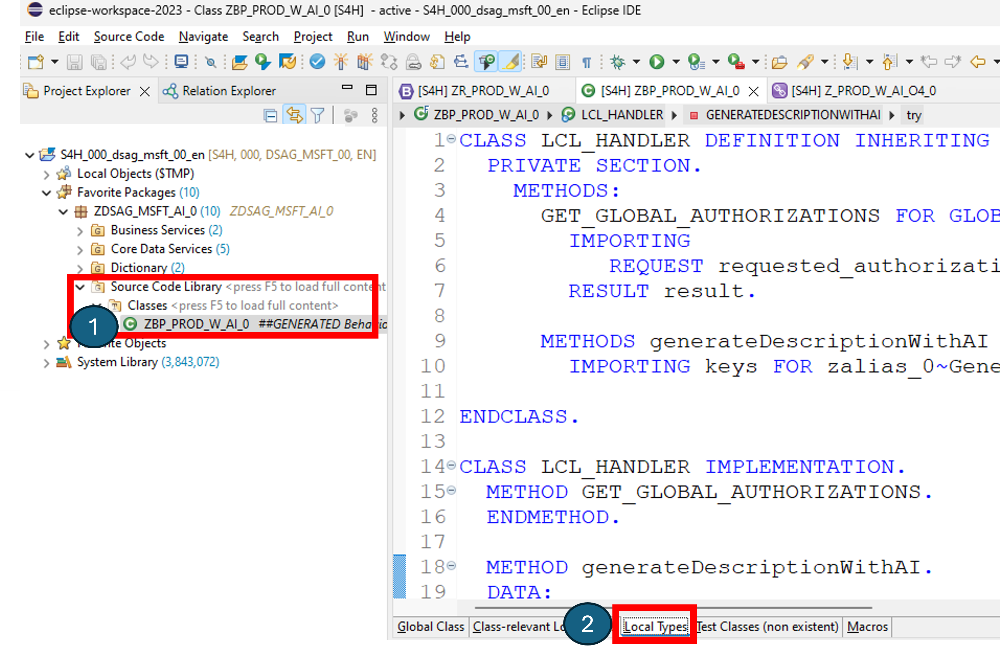
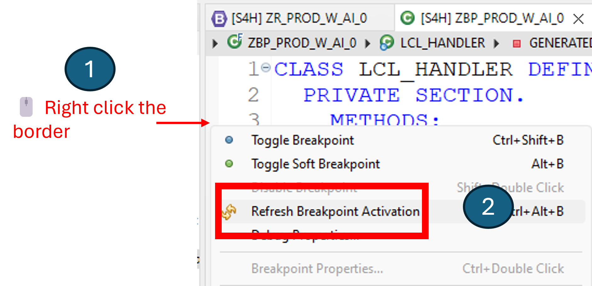
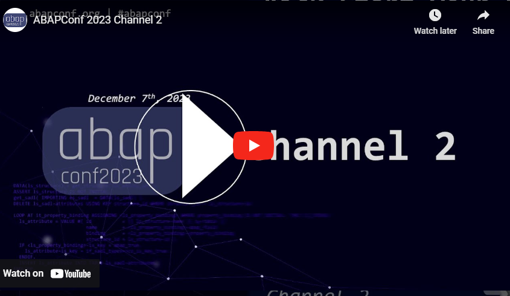

# Quest 4 - Add Microsoft AI SDK for SAP to your project

[ < Quest 3 ](quest3.md) - **[🏠Home](../README.md)**

🌟🌟🌟🌟🕒 45 mins

## Introduction

Now that you have a working prompt, you will add the Microsoft AI SDK for SAP to your project and use it to generate the product description during the create process.

## The path

The [AI SDK for SAP](https://microsoft.github.io/aisdkforsapabap/) is available on GitHub and has already been installed via [abapGit](https://docs.abapgit.org/user-guide/getting-started/install.html) on the SAP lab system (S/4HANA 2022) before you entered the dungeon.

> [!WARNING]
> If you happen to run into "Object could not be locked" error on Eclipse blocking yourself, close the tab and re-open. Worst-case talk to your dungeon master to help you out on SM12.

### Enhance behavior of the RAP service

1. Open your generated behavior implementation class object `ZBP_PROD_W_AI_##` and navigate to the "LCL_HANDLER" class using the `Local Types` tab at the bottom of the code view on Eclipse.



2. Paste the following code (don't forget to replace the ## with your number) into the class definition. This implementation of method `generateDescriptionWithAI` will be used to generate the product description with the AI SDK for SAP. It executes `on save` of a new product during the create process.

```diff
CLASS LCL_HANDLER DEFINITION INHERITING FROM CL_ABAP_BEHAVIOR_HANDLER.
  PRIVATE SECTION.
    METHODS:
      GET_GLOBAL_AUTHORIZATIONS FOR GLOBAL AUTHORIZATION
        IMPORTING
+           REQUEST requested_authorizations FOR ZPRODUCT_##
        RESULT result.
        
+      METHODS generateDescriptionWithAI FOR DETERMINE ON SAVE
+        IMPORTING keys FOR ZPRODUCT_##~GenerateDescriptionWithAI.
ENDCLASS.

CLASS LCL_HANDLER IMPLEMENTATION.
  METHOD GET_GLOBAL_AUTHORIZATIONS.
  ENDMETHOD.
  
+  METHOD generateDescriptionWithAI.
  ENDMETHOD.
ENDCLASS.
```

3. Save (<kbd> Ctrl </kbd> + <kbd> s </kbd>) and activate the class (<kbd> Ctrl </kbd> + <kbd> F3 </kbd>).

### Read the AI SDK for SAP documentation regarding chat completions

Your ABAP class is ready to be enhanced with the AI SDK for SAP. Before you do that, you should browse the documentation of the AI SDK for SAP regarding [chat completions with GPT3 models](https://microsoft.github.io/aisdkforsapabap/docs/working-with-sdk/completions).

### Configure the AI SDK for SAP

1. Implement the `generateDescriptionWithAI` method on the LCL_HANDLER class you just opened. Use below code. Can you tell what it does?

```diff
DATA:
      chatcompl_input  TYPE zif_peng_azoai_sdk_types=>ty_chatcompletion_input,
      chatcompl_output TYPE zif_peng_azoai_sdk_types=>ty_chatcompletion_output,
      status_code      TYPE i,                                 "Return Status Code
      status_reason    TYPE string,                            "Return Status Reason
      returnjson       TYPE string,                            "Return JSON. The content of this JSON string is parsed and made available through ABAP data types.
      error            TYPE zif_peng_azoai_sdk_types=>ty_error. "ABAP Type for Error

        TRY.
            data(sdk_instance) = zcl_peng_azoai_sdk_factory=>get_instance( )->get_sdk(
                                                                      api_version = '2023-03-15-preview'
+                                                                      api_base    = 'https://to-be-replaced.openai.azure.com'
                                                                      api_type    = zif_peng_azoai_sdk_constants=>c_apitype-azure
+                                                                      api_key     = 'get from dungeon master'
                                                                    ).
          "Limit the tokens being used per OpenAI GPT request
          chatcompl_input-max_tokens = 4000.
          "Construct the prompt with system and user roles.
          APPEND INITIAL LINE TO chatcompl_input-messages ASSIGNING FIELD-SYMBOL(<fs_message>).
          <fs_message>-role = zif_peng_azoai_sdk_constants=>c_chatcompletion_role-system.
          <fs_message>-content = |You are a virtual assistant suggesting creative product descriptions. Use less than 200 characters.|.

          "Supply Category and Name from new Product create request to OpenAI for description generation
          APPEND INITIAL LINE TO chatcompl_input-messages ASSIGNING <fs_message>.
          <fs_message>-role = zif_peng_azoai_sdk_constants=>c_chatcompletion_role-user.
          <fs_message>-content = |Create a description for the product with    |.
          "
+          READ ENTITIES OF zr_prod_w_ai_## IN LOCAL MODE
+            ENTITY ZPRODUCT_##
            ALL FIELDS WITH CORRESPONDING #( keys )
            RESULT DATA(Product).
*          "Iterate through individual booking fields to get access to current RAP BO
          Loop at Product into data(myproduct).
            <fs_message>-content = |{ <fs_message>-content } Name: { myproduct-Name } and Category: { myproduct-Category }|.
          endloop.

          " Execute Chat Completion request with Azure OpenAI
          " It is recommended to tune the prompt using the Azure OpenAI studio: https://oai.azure.com/portal
          " Learn more about design techniques here: https://learn.microsoft.com/azure/ai-services/openai/concepts/advanced-prompt-engineering?pivots=programming-language-chat-completions#start-with-clear-instructions
           chatcompl_input-user = 'Test'.

          sdk_instance->chat_completions( )->create(
            EXPORTING
              deploymentid = 'gpt-35-turbo'
              prompts      = chatcompl_input
            IMPORTING
              statuscode   = status_code
              statusreason = status_reason
              response     = chatcompl_output
              error        = error
          ).

        if error is initial.

+            DATA update_line TYPE STRUCTURE FOR UPDATE zr_prod_w_ai_##\\ZPRODUCT_##.
+            Data update type table for update zr_prod_w_ai_##\\ZPRODUCT_##.
            clear update_line.

           update_line-%tky = myproduct-%tky.
           "Set new Description from Azure OpenAI generated text
           update_line-Description = chatcompl_output-choices[ 1 ]-message-content.
           append update_line to update.

        else.
          APPEND VALUE #( %tky = myproduct-%tky
                          %msg = new_message_with_text(
                                   severity = if_abap_behv_message=>severity-information
                                   text     = 'error' )
+                        ) TO reported-ZPRODUCT_##.
        endif.
    " write back the AI generated Description to newly created booking before final save :-)
+    MODIFY ENTITIES OF zr_prod_w_ai_## IN LOCAL MODE
+      ENTITY ZPRODUCT_##
        UPDATE FIELDS ( Description )
        WITH update
    REPORTED DATA(update_reported)."collect issues into report

    reported = CORRESPONDING #( DEEP update_reported )."report any issues back to UI

    CATCH zcx_peng_azoai_sdk_exception INTO DATA(ex). " MSPENG:Azure Open AI ABAP SDK Exception
          APPEND VALUE #( %tky = myproduct-%tky
                          %msg = new_message_with_text(
                                   severity = if_abap_behv_message=>severity-information
                                   text     = ex->get_text( ) )
+                        ) TO reported-ZPRODUCT_##.
  ENDTRY.
```

2. Get the Azure OpenAI Service `api_base` and `api_key` from your dungeon master (or if you have access from Azure AI Studio) and maintain it in the code above.

3. Identify on the code above which OpenAI model your app is using.

4. Save (<kbd> Ctrl </kbd> + <kbd> s </kbd>) and activate the class (<kbd> Ctrl </kbd> + <kbd> F3 </kbd>).

5. Navigate back to your Fiori preview screen and create a new product. This time, the description will be generated by the Azure OpenAI Service orchestrated through the AI SDK for SAP. Take inspiration from below values.

| Field | Value |
| --- | --- |
| Product ID | 1000 |
| Name | Surface Laptop Studio 2 |
| Category | Laptop |
| Description | Leave empty for AI |
| Price | 2239 |
| Currency | EUR |

Optionally add a breakpoint on Eclipse and see your AI request in action step by step. Ensure liveliness of your debug session by clicking ``:

[](../media/quest4-2.png)

> [!TIP]
>🏆Finish the final quest and send [us](mailto:martin.pankraz@microsoft.com) a Screenshot of your Fiori screen with the best AI-generated product description to claim [your badge](https://webhostingforconverter.z16.web.core.windows.net/claim-reward.html) 😎

Let your coaches know what you liked best and which AI scenario you will be testing next in your own projects.

## (Optional) Elevate your AI game and train some more

You are one of the fast ones, huh? If so, apply your learnings from today and enhance the ABAP code to generate categories. This time no snippets ;-) Good luck!

## Manual product create is ok for now, but what about automation?

Check our below session from ABAPConf to see how you can leverage your beloved new RAP service to automate the whole product create process via Microsoft Power Automate and PDF processing.

[](https://www.youtube.com/watch?v=hleq0-NTVQo&t=9010s)

## Where to next?

[ < Quest 3 ](quest3.md) - **[🏠Home](../README.md)**

[🔝](#)
