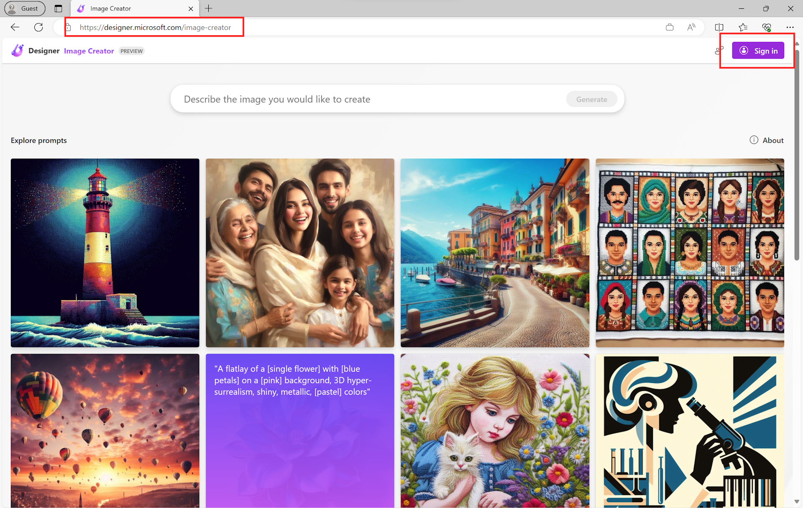
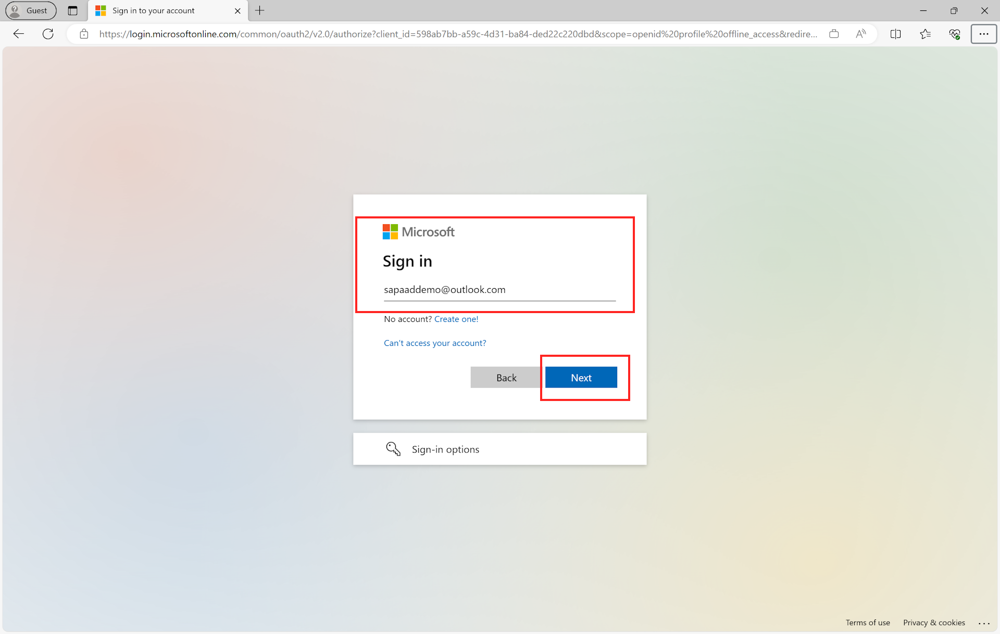
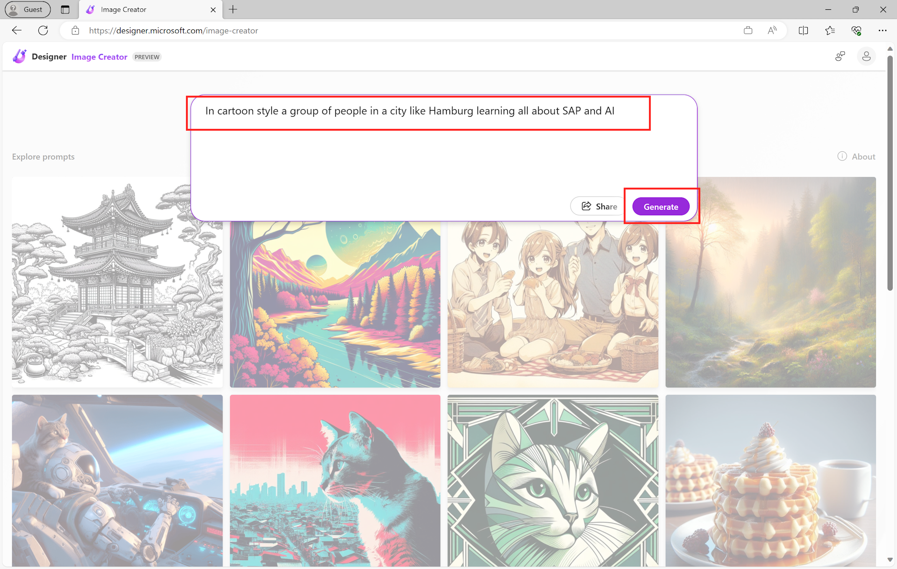
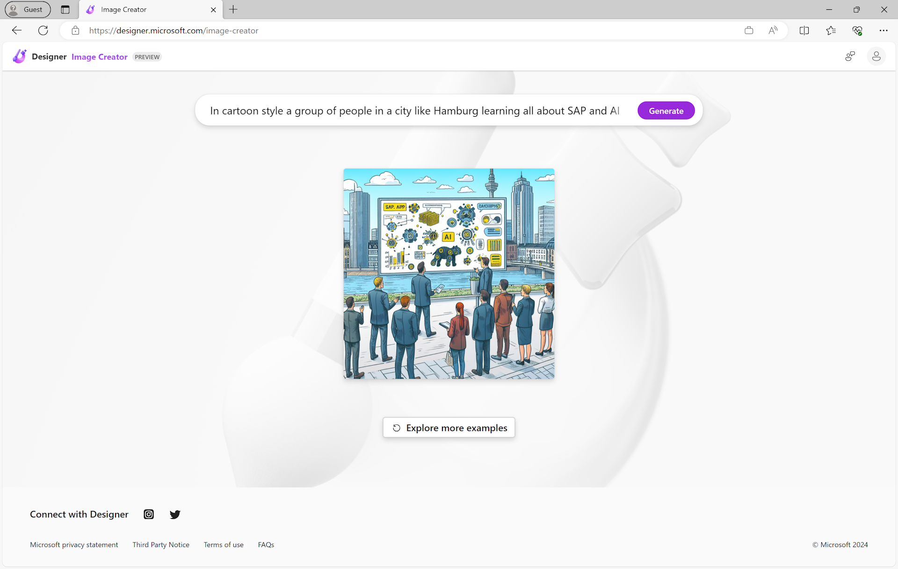
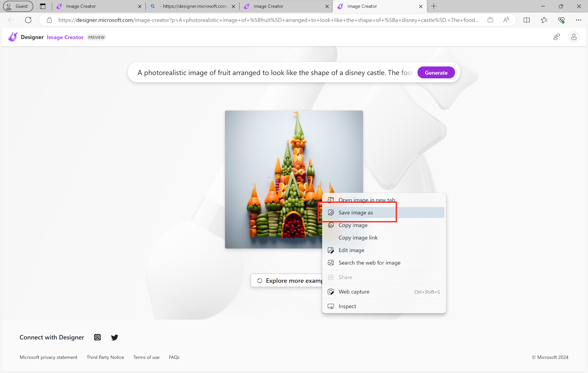
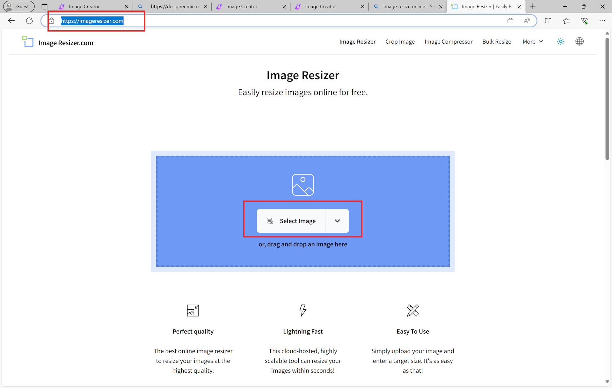
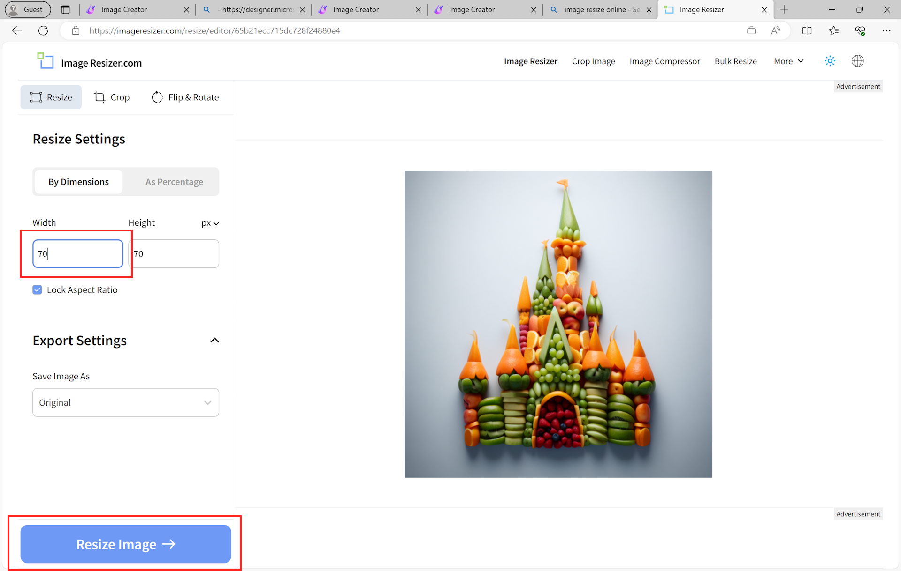
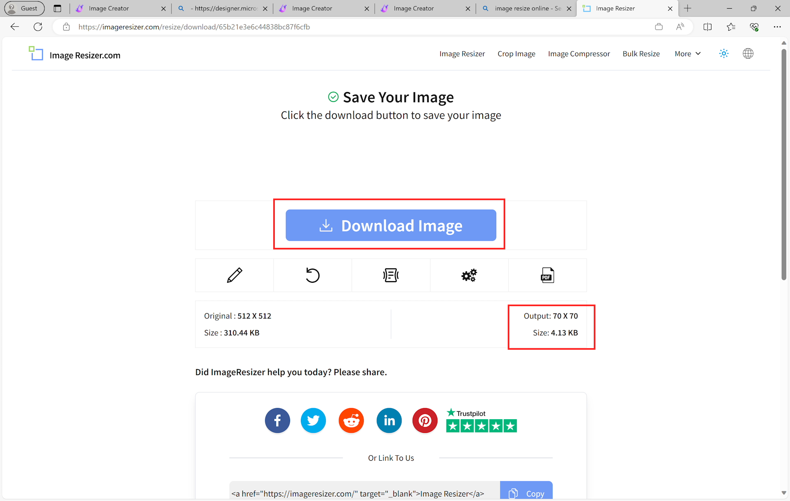

 # Quest 1 - Leveraging GPT to create images

**[🏠Home](../README.md)** - [ Quest 2 >](quest2.md)


* We will start our ChatBot and Generative AI journey by creating a few images. An easy way to get started are Microsoft Designer and Bing Image Creator, powered by DALL-E3. 

Feel free to check out both and play around with creating some images.  

* Go to [Microsoft Designer](https://designer.microsoft.com/image-creator) to open the Microsoft Designer


* Alternatively or in addition you can also go to [Bing Image Creator](https://www.bing.com/images/create)


* `Sign in` With your Microsoft ID (e.g. outlook.com, hotmail.com, live.com)



* Enter a prompt like 
```
In cartoon style a group of people in a city like Hamburg learning all about SAP and AI
```


* As a result you should see an image like this:



Like with all prompting it is important to learn how to work with the AI and create the best results. 
You can test out some ideas using the following links:

- [Person in City](https://designer.microsoft.com/image-creator?p=A+business+[woman]+learning+all+about+SAP+and+AI+in+a+city+like+[Hamburg],+detailed+[pencil]+sketch.+The+image+should+be+reusable+for+the+icon+of+a+chatbot)
- [Fruite Arrangements](https://designer.microsoft.com/image-creator?p=A+photorealistic+image+of+%5Bfruit%5D+arranged+to+look+like+the+shape+of+%5Ba+disney+castle%5D.+The+food+should+be+creativity+assembled+to+mimic+the+%5Bscene+from+the+disney+castle%5D.+The+image+should+be+colorful+and+appealing)

 
As you will notice, prompts often have adjectives and descriptions to make the generated image more explicit. Here are a few other ideas to improve your prompt: 
 
* **Other materials you might try**: "felt," "tapestry," "knitting," "embroidery," "papercraft," "origami," "pop-up books," "modelling clay," "porcelain," "ceramics," "terracotta," "metalwork," "jewelry," "crystal," "fiberglass"…even "butter."

* **Other photography-related terms to play with**: "trail cam," "CCTV," "VHS," "Polaroid," "infrared photography," "daguerreotype," "cyanotype," "photo from [a favorite magazine or website]," "film still from [a favorite movie or TV show]," "color splash," "extreme close-up," "wide-angle lens," "telephoto lens," "light leaks," "Lomography," "autochrome," "camera phone," "camera obscura," "warm lighting," "long exposure," "fast shutter speed," "back lighting," "low-key lighting," "golden hour," "blue hour," "macro lens," "motion blur," "shallow depth-of-field," "action photography," "candid portrait."

* **Other art styles to try**: "surrealism," "Dadaism," "metaphysical painting," "orphism," "cubism," "suprematism," "De Stijl," "futurism," "expressionism," "realism," "Bauhaus," "color field painting," "impressionism," "baroque," "rococo," "mannerism," "ancient Egyptian papyrus," "ancient Roman mosaic."

* **Try these phrases for different digital styles**: "digital art," "vector graphics," "minimalist," "geometric," "isometric," "2.5D," "matte clay," "digital painting," "screenshot from [a favorite game or animation]," "diagram," "instruction manual."

* **Try these words and phrases for different art styles**: "stencil art," "crayon," "chalk," "etching," "oil paintings," "ballpoint pen," "colored pencil," "Chinese watercolor," "pastels," "woodcut," "charcoal," "screen print," "photocollage," "storybook illustration," "newspaper cartoon," "vintage illustration from [decade]."

From [How to use AI image prompts to generate art using DALL‑E](https://create.microsoft.com/en-us/learn/articles/how-to-image-prompts-dall-e-ai)

* `Right click` on the image and save it to your laptop


* Since we want to use this image as an icon for our Chatbot in the next Quest, we need to resize it quite a bit. Since we don't want to install any other tools we will just use any Online resizing tool (feel free to use anything else). For this go to [ImageResizer](https://imageresizer.com/) and select the image that you just downloaded



* Since we need a rather small image, select enter `70` for the Width and click on `Resize Image` 


* Now you should have a much smaller image, that you can download by clicking on `Download image`. We will use this new icon later on. 



## Where to next?

**[🏠Home](../README.md)** - [ Quest 2 >](quest2.md)

[🔝](#)
