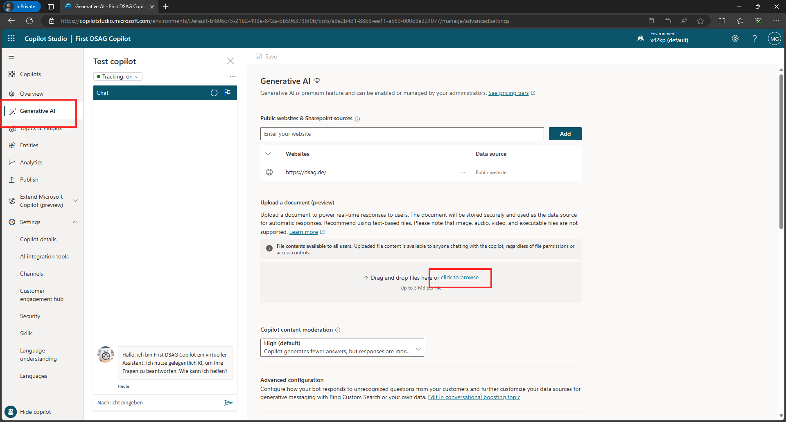
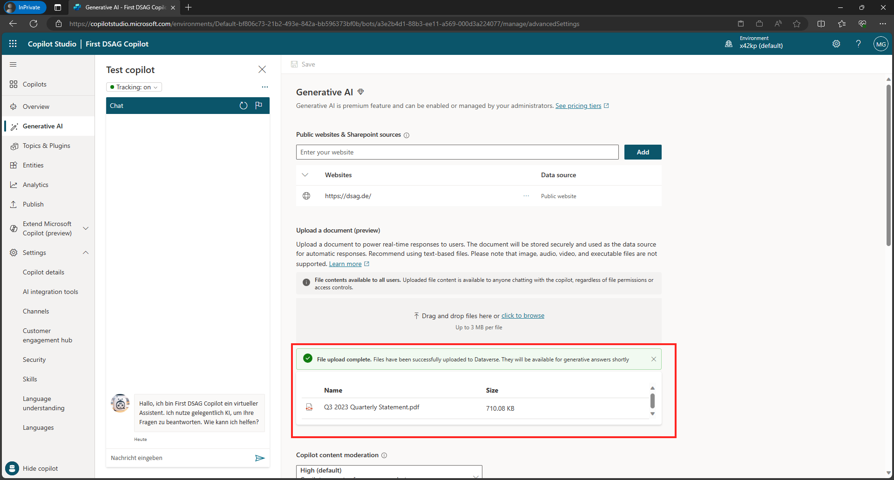
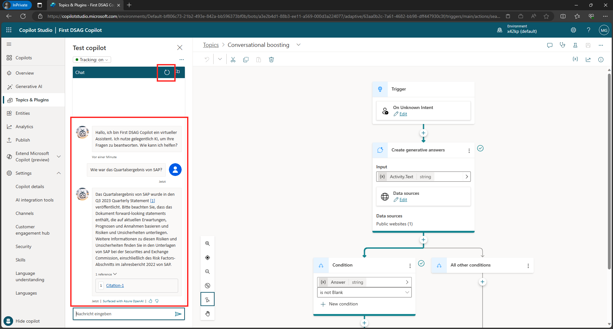
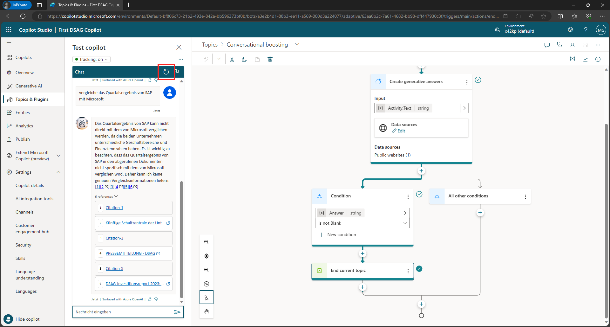

# Quest 3 - Upload your own data

[ < Quest 2 ](quest2.md) - **[ Quest 4 > ](quest4.md)**

Upload your own data
In addition to leveraging Public websites, Copilot Studio can also access documents in private SharePoint libraries, or documents that have been uploaded before. 

* Navigate to `Generate AI` and click `click to browse`

Examples can be found here:
- https://www.sap.com/investors/en/reports.html?sort=latest_desc&tab=reports#reports
- https://www.microsoft.com/en-us/Investor/annual-reports.aspx

> [!NOTE]
> It can take up to 15 minutes until the documents are indexed. 

* Upload a private document in Txt or PDF format with Drag&Drop
 

* Repeate the same for additional documents

* Once you have uploaded several documents, restart the conversation and ask the bot some related questions 
> [!NOTE]
> Even if the document has been uploaded in English, you can still ask it with different languages

e.g. `Wie war das Quartalsergebnis von SAP?` oder
"vergleiche das Quartalsergebnis von SAP mit Microsoft" und 
"wie war der Cloud Umsatz von SAP?"

* Feel free to publish the Chatbot following the steps in the previous quest

## Where to next?
[ < Quest 2 ](quest2.md) - **[ Quest 4 > ](quest4.md)**

[🔝](#)
