# Quest 4 - Chat against SAP Product 

[ < Quest 3 ](quest3.md) - **[🏠Home](../README.md)**

So far we have only accessed static information from either the public internet or documents that we had uploaded. Now we want to connect to an SAP system. Data in the SAP system can change frequently. So instead of indexing the information, we want to do a live query to the SAP and return some information. 

As before we will use the power of generative AI to help us interact with the bot and understand the question. In order to simplify the flow in the chatbot, we will disable the system trigger "Conversational boosting" and only focus on the "Fallback" trigger, which then will call a Power Automate flow. 
This Power Automate flow is pre-build and basically takes the input from the Copilot Studio chabot, extracts the intend and asks the SAP ES5 system for product information. 

> [!NOTE]
> Note: You can take a look at the Power Automate Flow [here](../media/quest4/PowerAutomateFlow.png). 


* Go to `Topics & Plugins` -> `Systems` and disable the `Conversational boosting`
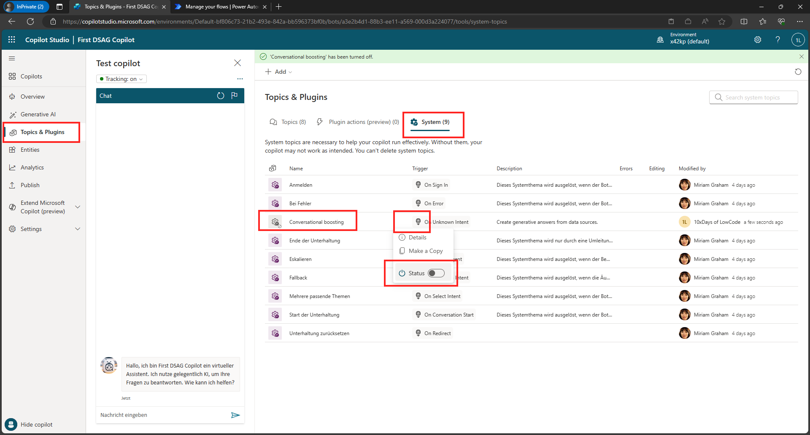

* Stay in the section of `System` topics, select the `Fallback` topic and under the first Trigger, click on `+` and from `Advanced` -> select `Send HTTP request`
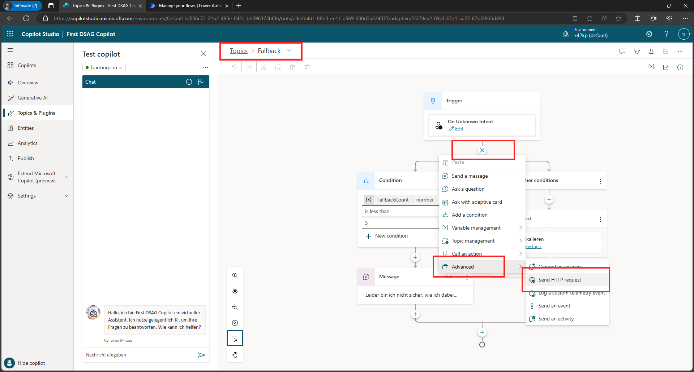

* Change the Method to `Post` and use the following URL to call a preconfigured Power Automate flow that handles the connection to the SAP system. 
  ```http
  https://prod-117.westus.logic.azure.com:443/workflows/2b7d54acc9e94c3b93dee086b4d28a96/triggers/manual/paths/invoke?api-version=2016-06-01&sp=%2Ftriggers%2Fmanual%2Frun&sv=1.0&sig=rez20vuZsRsAa3glEQGqzjQj5Enn5UELQEQxcFJP2rY
  ```
  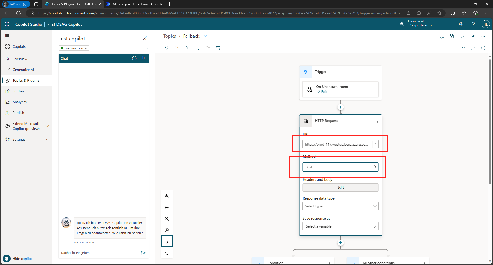

* Under `Headers and body` Click on `Edit` and on the right hand side, select `Raw content` from the drop-box
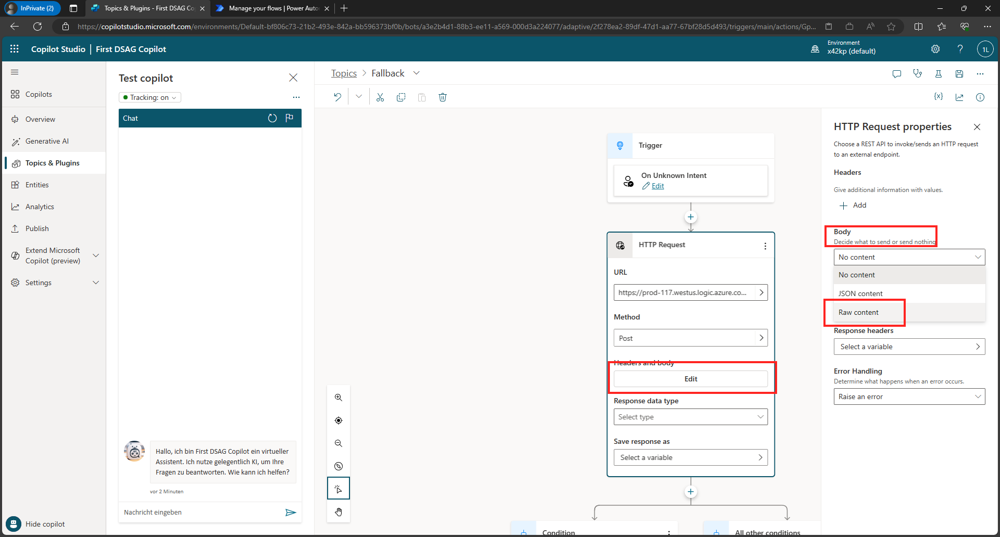

* Click on the arrow in the `Content` drop-down box and from System select `Activity.Text`
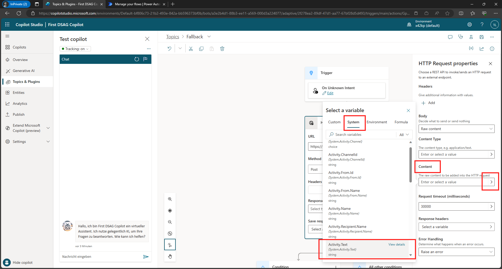

* Back on the main screen select the `Response type` to `String`
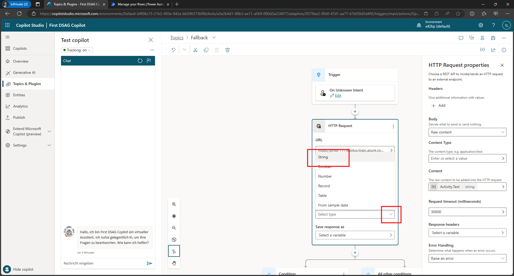

* For the `Save response as` click on `Create a new variable`
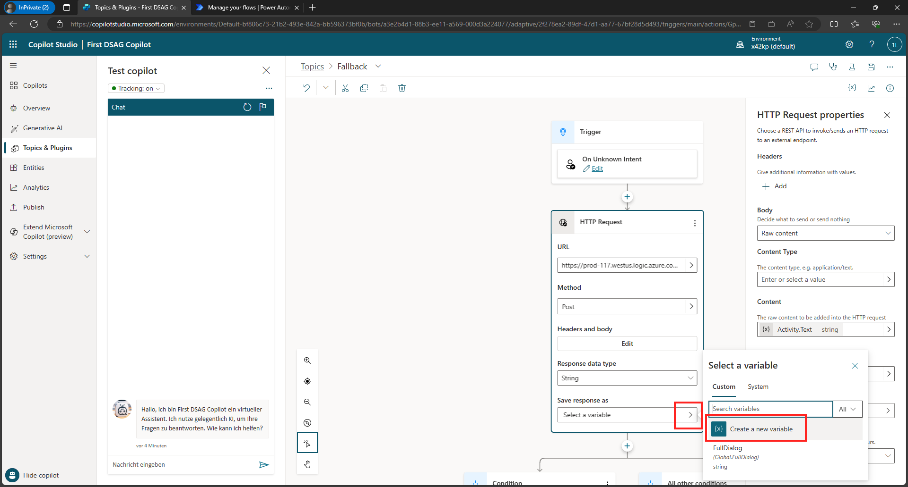

* Change the name of the variable to `ResponseFromSAP` and make sure to select `Global` under Usage and check the box for `Allow to carry between sessions`
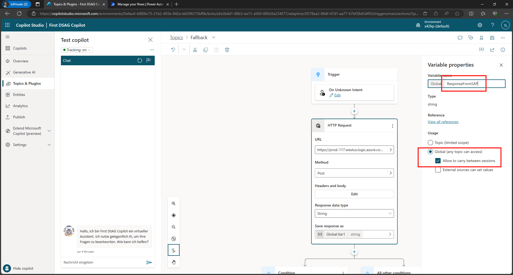

* `Delete` the `Condition` flow. Select the three dots and click on `Delete`
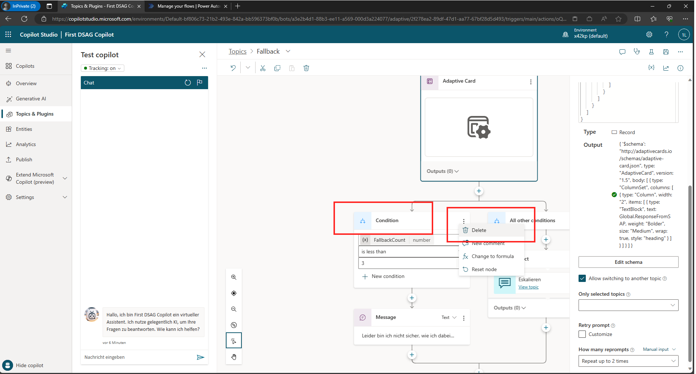

* Click on the `+` to add the `Send message step`
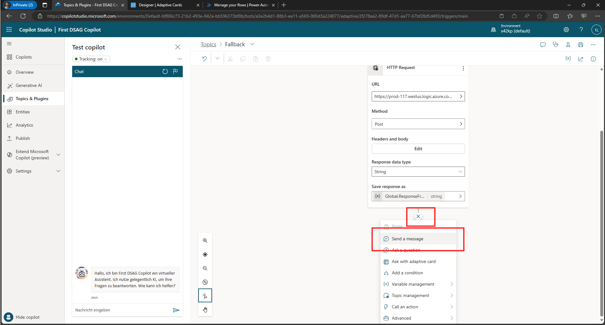

* Click on the `+ Add` icon and select `Adaptive card`
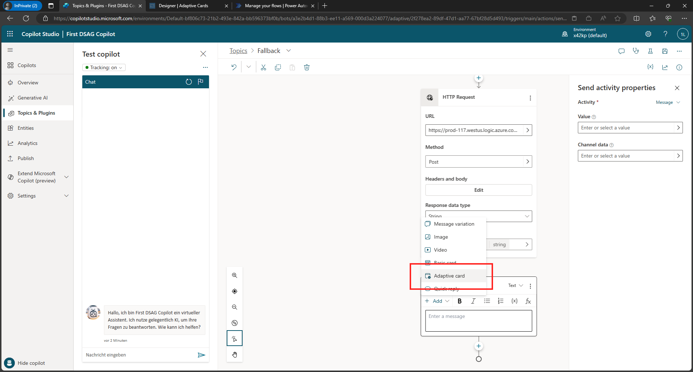

* On the right hand side click on `Edit JSON` and select `Formula`
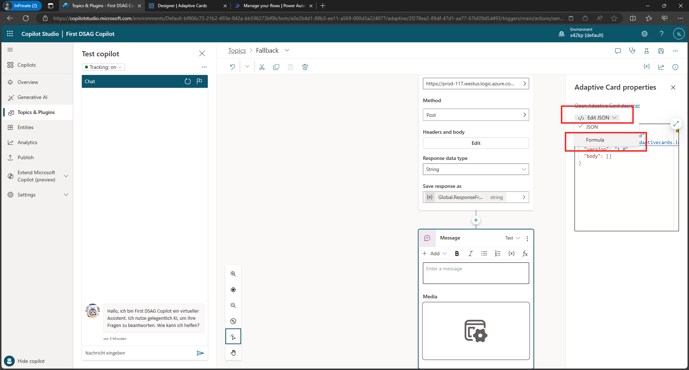

* Now copy the following content to the body 
    ```json
    {
      '$schema': "http://adaptivecards.io/schemas/adaptive-card.json",
      type: "AdaptiveCard",
      version: "1.5",
      body: [
    
    
            {
                type: "ColumnSet",
                columns: [
                    {
                        type: "Column",
                        width: 1,
                        items: [
                            {
                                type: "TextBlock",
                                text: Global.ResponseFromSAP,
                                size: "Medium",
                                wrap: true,
                                style: "normal",
                                fontType: "Default"
                            }
                        ]
                    }
                ]
            }
      ]
    }

    ```

  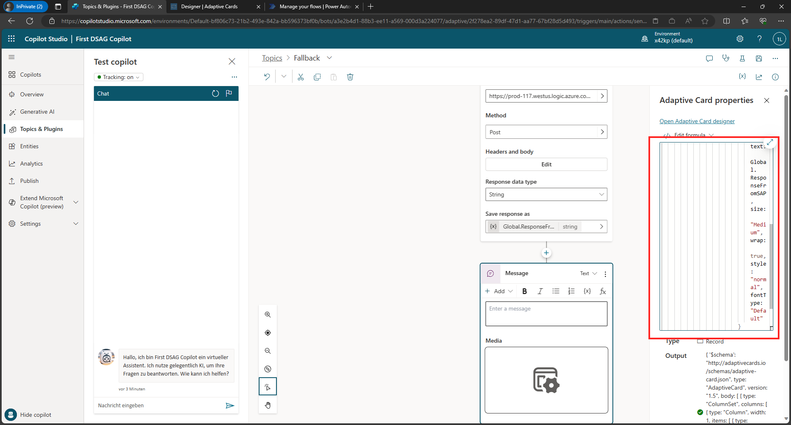

* Close the pop-up pane on the right by clicking the `X` in the upper right corner.

* Now we can test the new functionalities. Enter something like `Show me products from SAP`
    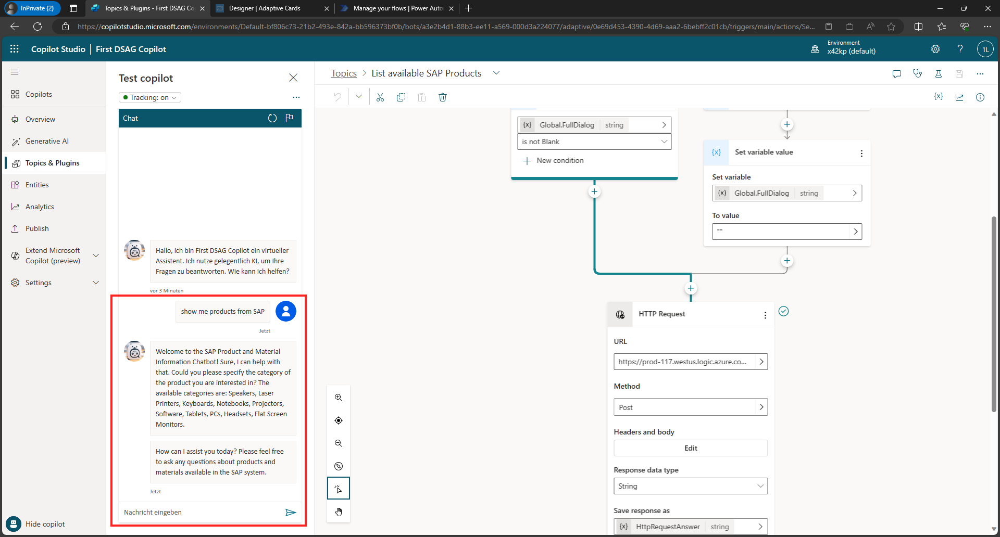

* Feel free to continue the conversation with the bot. (E.g., by responding with `Speakers, please.` if you're asked which category you are interested in.)

* Save your changes by clicking the button in the upper right corner.

* You can also publish the new changes. Click on `Publish` on the left hand side, and `Publish`. Then you can click on the `Demo Website` 
    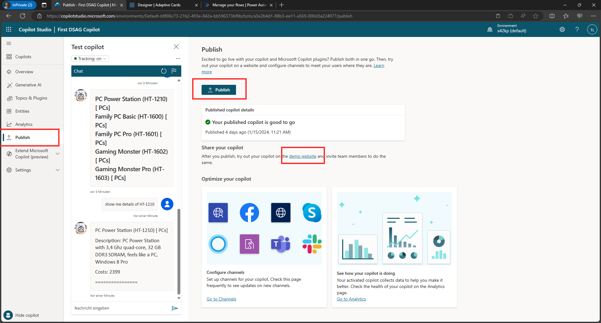

* Test the bot on the demo site
   

> [!TIP]
>🏆Finish the final quest and send [us](mailto:holger.bruchelt@microsoft.com) a link to your bot to claim [your badge](https://webhostingforconverter.z16.web.core.windows.net/claim-reward-chatgpt.html) 😎 May the ninja-cat be with you.

## Where to next?

[ < Quest 3 ](quest3.md) - **[🏠Home](../README.md)**

[🔝](#)
