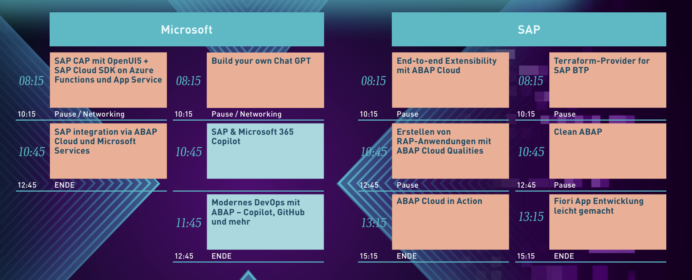

# 🌌DSAG TechXChange 2024 - Microsoft track📎

Welcome to your SAP with Microsoft hands-on lab experience! This repos gets you all setup to embark on your assigned epic quest. Excited yet? This is the line up including the lectures taking place on the 8th of February 2024:

Find us on-site in Hamburg. We are looking forward to meeting you in person! 🤝

## Introduction

| Lab             | Dungeon entry  | Description |
| ---------------- | -------- | -------- |
| Kick-off with SAP Cloud Application Programming Model (CAP) on Azure | [🏰](./1-sap-cap-on-azure/README.md) | Learn how to build a cloud-native application with CAP and deploy it to Azure. |
| Use ABAP Cloud to seamlessly integrate with Microsoft services | [⛩️](./2-abap-cloud-with-microsoft/README.md) | Learn how to use ABAP Cloud to integrate with Azure storage to dump AL11 exports or the likes |
| Build your own ChatGPT | [🧙](./3-build-your-own-chatgpt/README.md) | Learn how to build your own chatbot with GPT-4 and deploy it to Azure. |
| Using Terraform for Cross-Cloud Setup of SAP BTP and Microsoft Azure | [🏗️](https://github.com/SAP-samples/teched2023-XP160) | Use industry-standard Terraform to deploy and provision your apps cross-cloud running on SAP Business Technology Platform (SAP BTP) Microsoft Azure leveraging the SAP Private Link service. |

## Recommended courses and further learning

## 📢Feedback

This repos encourages contributions and feedback via the [GitHub Issues](https://github.com/MartinPankraz/DSAGTechXChange24/issues/new/choose).

## 🚸 Your Adventure Guides

| Name             | Company  |
| ---------------- | -------- |
| [Holger Bruchelt](https://www.linkedin.com/in/holger-bruchelt/)  | Microsoft |
| [Bart Delanghe](https://www.linkedin.com/in/bart-delanghe/)    | Microsoft |
| [Thijs Zandvliet](https://www.linkedin.com/in/thijszandvliet/)  | Microsoft |
| [Sebastian Ullrich](https://www.linkedin.com/in/sebastian-ullrich-677b36168/)| Microsoft |
| [Jeffrey Groneberg](https://www.linkedin.com/in/jeffrey-groneberg-84b47412/)| Microsoft |
| [Bastian Ulke](https://www.linkedin.com/in/bastian-ulke/)     | Microsoft |
| [Volker Buzek](https://www.linkedin.com/in/volkerbuzek/)     | SAP Mentor |
| [Christian Lechner](https://www.linkedin.com/in/christian-lechner-inthecloud/)| SAP SE, Azure MVP |
| [Martin Pankraz](https://www.linkedin.com/in/martin-pankraz/)   | Microsoft |
