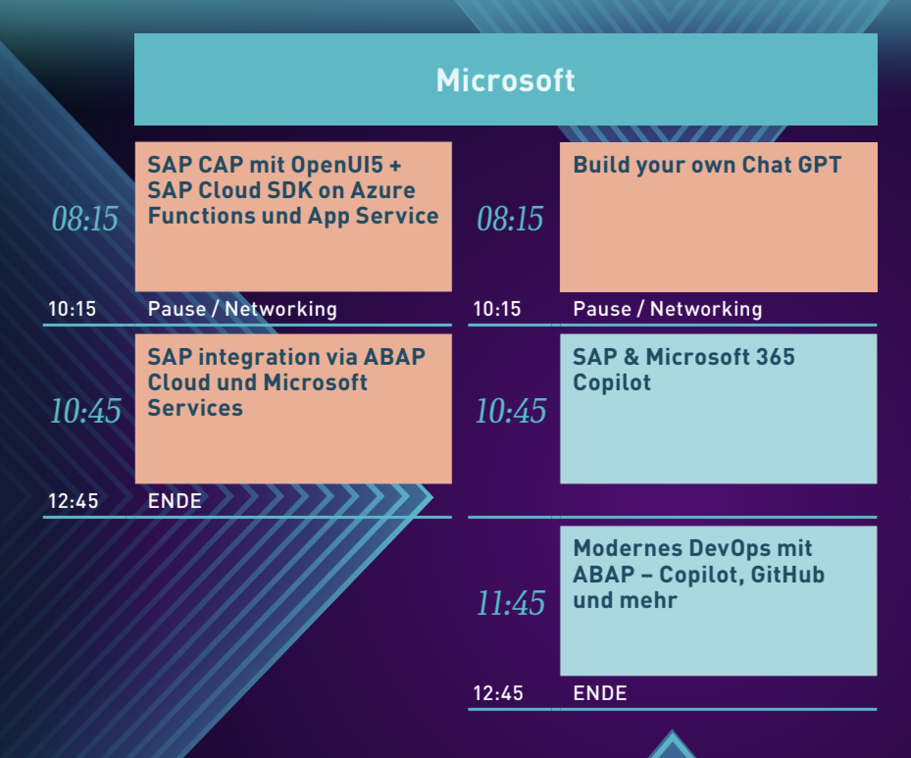

# 🌌DSAG TechXChange 2024 - Microsoft track📎

Welcome to your **SAP with Microsoft hands-on lab** experience! This repos gets you all setup to embark on your assigned epic quest. Excited yet? This is the line up including the lectures taking place on the 8th of February 2024:

Find us on-site in Hamburg. We are looking forward to meeting you in person! 🤝

## Introduction

| Lab             | Dungeon entry  | Description |
| ---------------- | -------- | -------- |
| Kick-off with **SAP Cloud Application Programming Model** (CAP) on Azure | 👉[🏰](./1-sap-cap-on-azure/README.md) | Learn how to build a cloud-native application with CAP and deploy it to Azure. |
| Use **ABAP Cloud** to seamlessly integrate with Microsoft services | 👉[⛩️](./2-abap-cloud-with-microsoft/README.md) | Learn how to use ABAP Cloud to integrate with Azure OpenAI, storage accounts to dump AL11 exports, or the likes |
| Build your own **ChatGPT** | 👉[🧙](./3-build-your-own-chatgpt/README.md) | Learn how to build your own chatbot with GPT-4 and deploy it to Azure. |

🔜 Using **Terraform for Cross-Cloud Setup** of **SAP BTP** and **Microsoft Azure**. Session 🗓️POSTPONED to [BTP Betriebstage](https://dsagnet.de/event/btp-betriebstag-1) on 19th - 20th of March in Frankenthal, Germany. Sign-up [here](https://dsagnet.de/event/btp-betriebstag-1).

Partner featured sessions [Neptune DXP with Microsoft Power Automate challenge](https://github.com/hobru/DSAGTechXChange-Neptune-PowerPlatform)

> [!TIP]
>🏆Finish the final quest, collect the pass phrase, and redeem it to claim [your badge](https://webhostingforconverter.z16.web.core.windows.net/claim-reward.html) 😎

## Recommended courses and further learning

* [AI-For-Beginners](https://microsoft.github.io/AI-For-Beginners/)
* [Develop SAP CAP apps with Azure App Service](https://github.com/Azure-Samples/app-service-javascript-sap-cap-quickstart)
* [Develop SAP extensions with SAP Cloud SDK and Azure Functions](https://github.com/Azure-Samples/functions-javascript-sap-cloud-sdk-quickstart)
* [Kick-Start your SAP ABAP Platform integration journey with Microsoft](https://blogs.sap.com/2023/06/06/kick-start-your-sap-abap-platform-integration-journey-with-microsoft/)

## 📢Feedback

This repos encourages contributions and feedback via the [GitHub Issues](https://github.com/MartinPankraz/DSAGTechXChange24/issues/new/choose).

## 🚸 Your Adventure Guides

| Name             | Company  |
| ---------------- | -------- |
| [Holger Bruchelt](https://www.linkedin.com/in/holger-bruchelt/)  | Microsoft |
| [Bart Delanghe](https://www.linkedin.com/in/bart-delanghe/)    | Microsoft |
| [Thijs Zandvliet](https://www.linkedin.com/in/thijszandvliet/)  | Microsoft |
| [Sebastian Ullrich](https://www.linkedin.com/in/sebastian-ullrich-677b36168/)| Microsoft |
| [Matt Schlarb](https://www.linkedin.com/in/matt-schlarb/)   | Microsoft |
| [Madalina Wagmann](https://www.linkedin.com/in/madalina-wagmann-sap-azure-specialist-pm/)   | Microsoft |
| [Jeffrey Groneberg](https://www.linkedin.com/in/jeffrey-groneberg-84b47412/)| Microsoft |
| [Bastian Ulke](https://www.linkedin.com/in/bastian-ulke/)     | Microsoft |
| [Volker Buzek](https://www.linkedin.com/in/volkerbuzek/)     | SAP Mentor |
| [Christian Lechner](https://www.linkedin.com/in/christian-lechner-inthecloud/)| SAP SE, Azure MVP |
| [Martin Pankraz](https://www.linkedin.com/in/martin-pankraz/)   | Microsoft |
